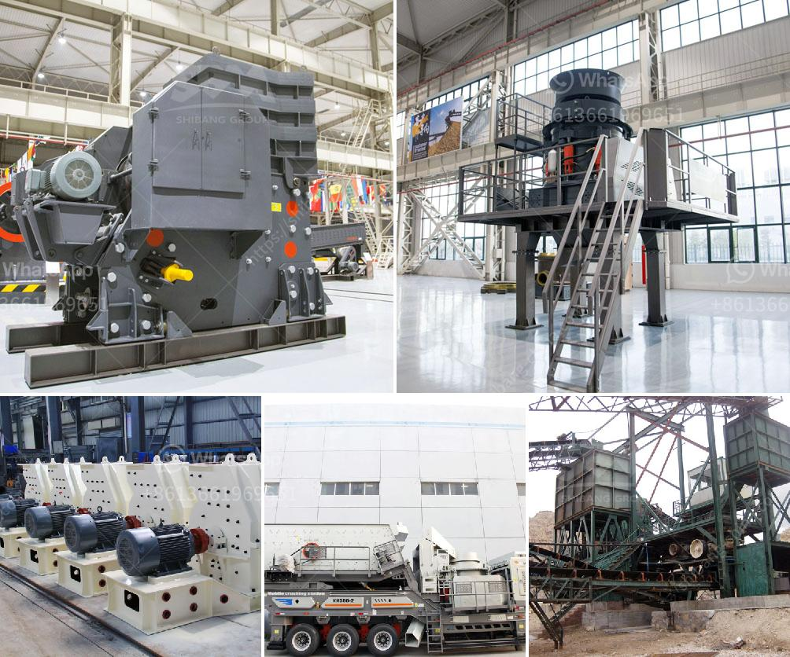

<h3>supplier of crusher equipment in ghana</h3>
Ghana, known as the "Gold Coast" in colonial times, is one of the richest countries in Africa. Mining has contributed significantly to Ghana's economic growth, and is the country's top foreign exchange earner. Nowadays, Ghana has over 30 large-scale international gold mining companies and other minerals, such as bauxite, manganese, and diamonds, are also mined in the country. For these minerals to be used in various industries, they need to be crushed into smaller pieces. This is where crusher equipment comes into play.

Crusher equipment is essential for the mining industry to reduce the size of ore to a manageable size for further processing. Like any other heavy machinery, crusher equipment is also subject to wear and tear, and the constant downtime will require maintenance and repair, which can be costly. Therefore, having a reliable supplier with quality crusher equipment is crucial for the success of any mining operation in Ghana.

One of the leading suppliers of crusher equipment in Ghana is MES. MES, also known as Mining and Engineering Services, offers a wide range of quality crusher parts and equipment that are used in the mining industry. MES has been supplying crusher parts and equipment to the mining industry for over 20 years, and its team of professional technicians has the experience and expertise to help customers find the right products for their specific needs.

MES offers a wide range of crushers, including jaw crushers, cone crushers, and impact crushers. These crushers are designed to handle various materials, from hard rock to soft rock, and they can produce different sizes of crushed material, depending on the customer's requirements. MES also provides spare parts for all its crushers, ensuring that customers can keep their equipment running smoothly without any downtime.

In addition to quality crusher equipment, MES also provides excellent customer service. Its team of dedicated technicians are available to assist customers with any technical issues, and MES also offers training programs to help customers optimize the use of their crusher equipment. This level of support ensures that customers can rely on MES for all their crusher equipment needs.

Furthermore, MES understands the importance of sustainability in the mining industry. It takes environmental responsibility seriously and strives to minimize the impact of its operations on the environment. MES ensures that its crusher equipment is designed to be energy efficient, reducing energy consumption and helping customers to achieve their sustainability goals.

In conclusion, having a reliable supplier of crusher equipment is crucial for the success of mining operations in Ghana. MES, with its extensive experience, quality products, and excellent customer service, is a top supplier in the country. Whether you are a small-scale miner or a large-scale international mining company, MES has the crusher equipment to meet your needs. With MES as your supplier, you can rest assured that you will receive the right products, reliable support, and a commitment to sustainability.
<h3>Contact us</h3><ul><li><strong>Whatsapp:&nbsp;<a href="https://wa.me/8613661969651">+8613661969651</a></strong></li><li><a href="https://swt.shibang-china.com/?git&amp;zhl&amp;supplier of crusher equipment in ghana"><strong>Online Service(chat now)</strong></a></li></ul><h3>Related</h3><ul><li><a href='ball mill china making.md'>ball mill china making</a></li><li><a href='conveyor belt for sale in south africa.md'>conveyor belt for sale in south africa</a></li><li><a href='stone crusher in ksa.md'>stone crusher in ksa</a></li><li><a href='how different impact crusher and hammer mill.md'>how different impact crusher and hammer mill</a></li><li><a href='small scale crushers in south africa.md'>small scale crushers in south africa</a></li></ul>