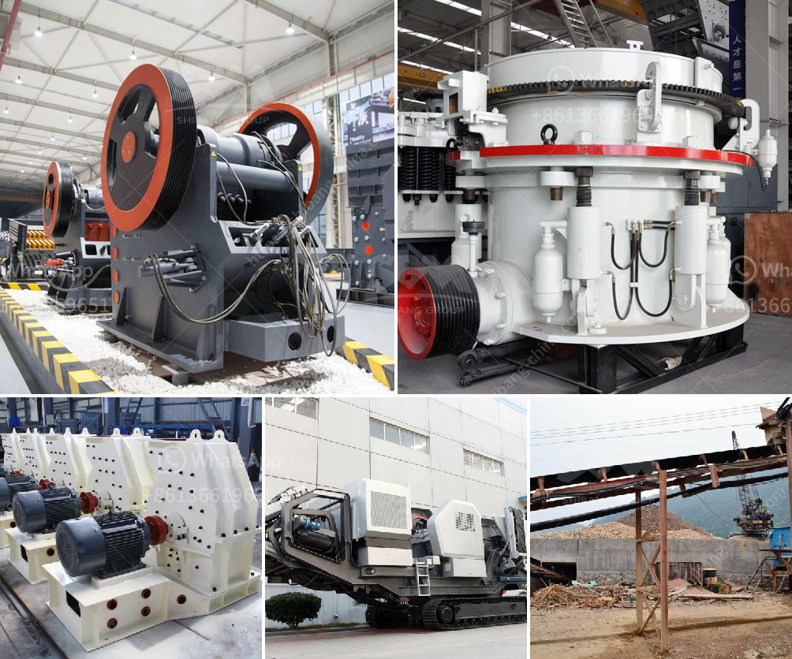

<h3>suppliers of mining equipment in south africa</h3>
South Africa is a renowned hub for mining operations due to its rich resources of precious metals, base metals, coal, and strategic minerals. As a result, mining equipment suppliers in South Africa have a wide array of options to cater to the needs of mining companies. However, with so many suppliers to choose from, it's important to ensure that you select a reliable and reputable supplier that understands your specific requirements and can provide top-quality equipment.

One of the leading suppliers of mining equipment in South Africa is Manhattan Corporation. This company offers a vast range of products and services tailored to suit the needs of various mining companies. With over three decades of experience, Manhattan Corporation has established a solid reputation for delivering cost-effective solutions that enhance productivity and efficiency in the mining sector.

Manhattan Corporation specializes in the design, manufacture, and supply of alluvial pumps, diamond and gold mining equipment, dredging equipment, and mineral processing plants. Their expansive product range includes crushers, screens, feeders, modular plants, coal crushers, vibrating screens, and conveyors. This full suite of equipment ensures that they can provide end-to-end solutions for any mining project.

Another reliable supplier in South Africa is DOVE Equipment & Machinery Co., Ltd. DOVE is a major manufacturer of mining equipment for various minerals including diamonds, gold, and other precious metals, base metals, ferrous metals, light metals, coal, and aggregates. The company's range of equipment includes crushers, mills, classifiers, concentrators, separators, and plants for gravity concentration, diamond concentration, coal preparation, and modular plant systems.

DOVE Equipment & Machinery Co., Ltd. prides itself on providing mining solutions that are customized to the specific needs and requirements of the client. Their products are designed to withstand the rugged conditions of mining operations and ensure maximum productivity and profitability. With a commitment to constant innovation and continuous improvement, DOVE Equipment & Machinery Co., Ltd. is a trusted provider of high-quality mining equipment in South Africa.

A third notable supplier is Bell Equipment. With a history spanning over 60 years, Bell Equipment has established itself as a prominent player in the mining industry. The company offers a range of innovative and reliable equipment, including ADTs (Articulated Dump Trucks), haulage tractors, front-end loaders, excavators, compactors, and graders. Their equipment is renowned for its durability, efficiency, and advanced technological features.

Bell Equipment recognizes that the mining industry operates in some of the harshest environments, and their equipment is built to withstand these conditions. The company also places a strong emphasis on customer support, offering comprehensive after-sales service and parts availability.

In conclusion, South Africa has a wide range of reputable suppliers of mining equipment to cater to the needs of the mining industry. These suppliers offer a diverse selection of equipment, from crushers and screens to conveyors and mills. It's crucial for mining companies to carefully assess their requirements and choose a supplier that can provide top-quality equipment that meets their specific needs. Whether it's Manhattan Corporation, DOVE Equipment & Machinery Co., Ltd., or Bell Equipment, these suppliers have proven track records and are trusted names in the industry.
<h3>Contact us</h3><ul><li><strong>Whatsapp:&nbsp;<a href="https://wa.me/8613661969651">+8613661969651</a></strong></li><li><a href="https://swt.shibang-china.com/?git&amp;zhl&amp;suppliers of mining equipment in south africa"><strong>Online Service(chat now)</strong></a></li></ul><h3>Related</h3><ul><li><a href='consol glass recycling price list south africa.md'>consol glass recycling price list south africa</a></li><li><a href='rock crusher portable.md'>rock crusher portable</a></li><li><a href='cost of setting up a mini cement plant in india.md'>cost of setting up a mini cement plant in india</a></li><li><a href='iron ore mines equipments.md'>iron ore mines equipments</a></li><li><a href='concrete recycling crushing machine.md'>concrete recycling crushing machine</a></li></ul>