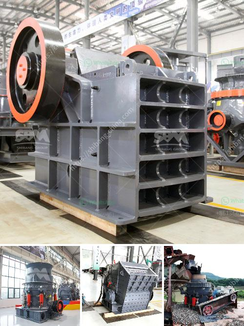

<h3>talc ball mills south africa</h3>
Talc is a mineral made up primarily of magnesium, silicon, and oxygen. It is commonly used in the production of various everyday products, including cosmetics, ceramics, paint, paper, and plastics. However, the process of obtaining finely ground talc powder is not as simple as it seems. This is where talc ball mills come into the picture.

In South Africa, this process is conducted primarily by large mining companies. Talc ball mills are a vital part of the industry in South Africa, as they grind talc ores into fine powder, which is essential for further processing.

Talc balls mills operate on a similar principle to that of traditional ball mills. However, they differ in terms of their structural design and specific purpose. Talc ball mills are designed with spherical shape balls and have a cylindrical casing, which helps to grind the talc ore into fine particles. The rotation of the cylinder creates centrifugal force, producing impact and grinding actions.

One of the reasons why talc ball mills are widely used in South Africa is their versatility. They can grind different types of ores, including talc, marble, and limestone. Additionally, these mills can be customized to meet specific requirements, such as output size, capacity, and power consumption.

In South Africa, the majority of talc ball mills are imported from reputable manufacturers around the world. These manufacturers ensure that their mills meet international standards and are durable and efficient. Some well-known manufacturers in the field include Fote Machinery and SBM.

Talc ball mills in South Africa play a vital role in the talc ore extraction process, as they reduce the large chunks of talc into fine powder by gradually crushing and grinding it. These mills are also known for their ability to reduce energy consumption, while ensuring the quality and uniformity of the final product.

The use of talc ball mills in South Africa has greatly contributed to improving the overall efficiency of the talc extraction process. This has resulted in increased production and reduced costs for the mining companies operating in the region. Moreover, the finely ground talc powder produced by these mills has found its application in various industries, contributing to the economic growth of the country.

However, it is important to note that talc ball mills also come with some challenges. For instance, the maintenance and repair of these mills can be complex and costly. Additionally, the high energy consumption associated with milling operations can impact the sustainability of the industry in the long run.

In conclusion, talc ball mills in South Africa have proven to be essential equipment in the talc extraction process. Their ability to efficiently grind talc ores into fine powder has greatly improved the overall production and quality of talc products. However, to ensure a sustainable and efficient operation, it is crucial for mining companies to invest in regular maintenance and explore energy-efficient technologies.
<h3>Contact us</h3><ul><li><strong>Whatsapp:&nbsp;<a href="https://wa.me/8613661969651">+8613661969651</a></strong></li><li><a href="https://swt.shibang-china.com/?git&amp;zhl&amp;talc ball mills south africa"><strong>Online Service(chat now)</strong></a></li></ul><h3>Related</h3><ul><li><a href='to separate manganese and iron ore.md'>to separate manganese and iron ore</a></li><li><a href='cost of grinding machines.md'>cost of grinding machines</a></li><li><a href='ball price for 200 tons.md'>ball price for 200 tons</a></li><li><a href='barite mill saltillo.md'>barite mill saltillo</a></li><li><a href='quarry machines for sale in kenya.md'>quarry machines for sale in kenya</a></li></ul>