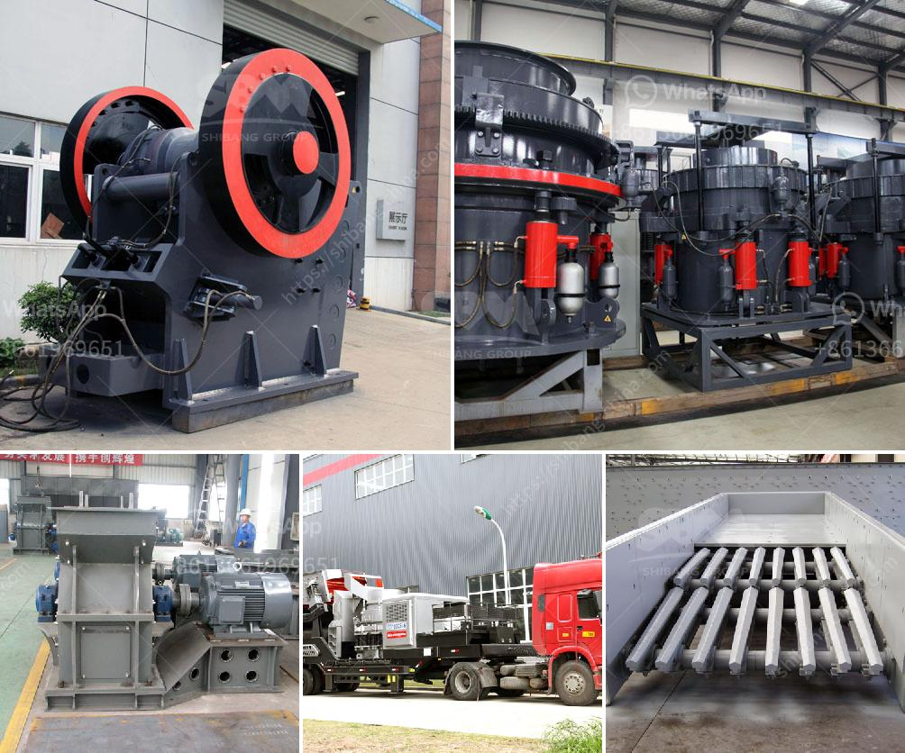

<h3>talc grinding machine manufacturer from uzbekistan</h3>
Talc is a mineral that is commonly used in various industries, such as cosmetics, ceramics, paint, paper, and more. Due to its unique properties, talc is often ground into a fine powder to achieve the desired particle size for its intended applications. In Uzbekistan, there is a leading talc grinding machine manufacturer who specializes in providing high-quality machines and support for efficient talc grinding processes.

The talc grinding machine manufactured by this company is widely used for high-efficiency talc grinding purposes. With its excellent productivity and advanced grinding technology, it is beneficial for customers to improve grinding efficiency and reduce energy consumption. The machine also features a user-friendly interface, making it easy to operate and maintain.

One of the notable advantages of this talc grinding machine is its precise particle size control capabilities. The machine is equipped with a dedicated control system that allows for accurate adjustment of particle size, ensuring consistent quality and uniformity of the final product. This is particularly important for industries that require specific particle size distribution for their applications.

Furthermore, this talc grinding machine manufacturer offers a comprehensive after-sales service, including installation guidance, machine testing, and technical support. Their team of experienced engineers and technicians is always ready to assist customers with any issues or questions they may have.

In addition to its reliable products and excellent services, this talc grinding machine manufacturer from Uzbekistan emphasizes the importance of sustainable and eco-friendly manufacturing practices. They strive to reduce the environmental impact of their operations by implementing energy-efficient technologies and minimizing waste generation.

In conclusion, the talc grinding machine manufacturer from Uzbekistan provides a reliable and efficient solution for talc grinding processes. With their high-quality machines, advanced technology, and comprehensive after-sales service, they have gained a positive reputation in the industry. Their commitment to sustainable manufacturing practices is also commendable. If you are in need of a reliable talc grinding machine, choosing this manufacturer would be a sound decision.
<h3>Contact us</h3><ul><li><strong>Whatsapp:&nbsp;<a href="https://wa.me/8613661969651">+8613661969651</a></strong></li><li><a href="https://swt.shibang-china.com/?git&amp;zhl&amp;talc grinding machine manufacturer from uzbekistan"><strong>Online Service(chat now)</strong></a></li></ul><h3>Related</h3><ul><li><a href='industerial ball mill for sale.md'>industerial ball mill for sale</a></li><li><a href='manufacturer of conveyor belts.md'>manufacturer of conveyor belts</a></li><li><a href='jaw crusher vs gyratory crusher stone crusher quarry.md'>jaw crusher vs gyratory crusher stone crusher quarry</a></li><li><a href='selling stone crusher plant.md'>selling stone crusher plant</a></li><li><a href='wanted 120 ton of stone crusher.md'>wanted 120 ton of stone crusher</a></li></ul>