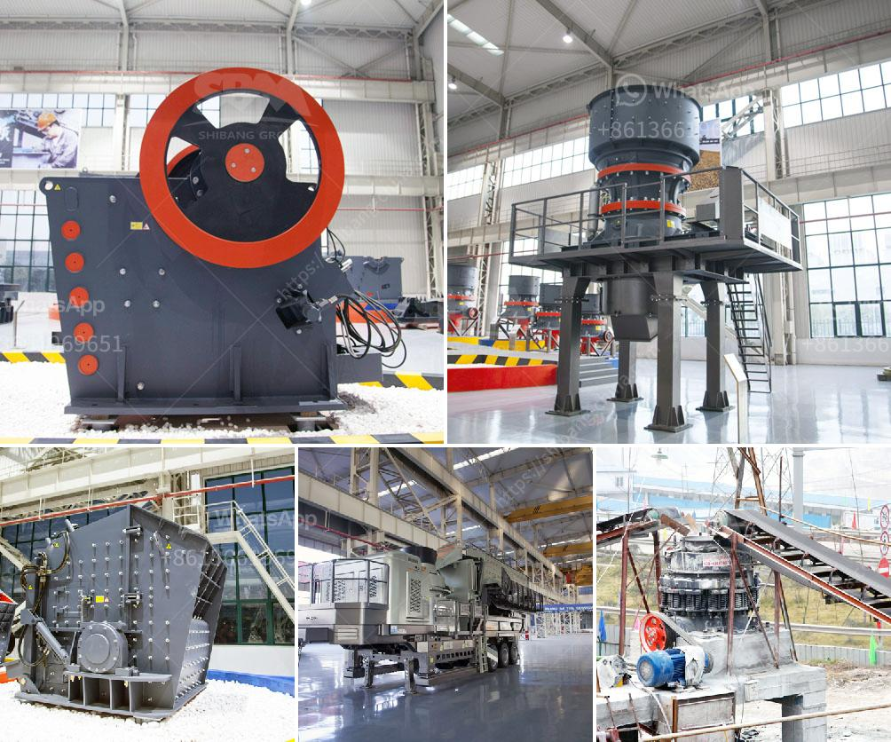

<h3>talc production process</h3>
Talc, also known as magnesium silicate, is a soft mineral that is widely used in various industries. It is primarily known for its use in cosmetics, but it is also found in paints, plastics, ceramics, rubber, and even food products. The production process of talc involves a series of steps, each designed to separate impurities and achieve the desired particle size and purity.

The first step in talc production is mining. The talc ore is extracted from the earth using various techniques, such as underground mining, open-pit mining, or strip mining. Once the ore is obtained, it is transported to the production site for further processing.

Next, the ore is crushed and ground into fine particles. This step is essential to increase the surface area of the talc and facilitate the subsequent separation of impurities. Crushing and grinding can be accomplished using various equipment, such as jaw crushers, gyratory crushers, cone crushers, and rod mills.

Once the talc ore is finely ground, it undergoes a process called flotation. Flotation involves adding chemicals to the ground ore to make it hydrophobic (water-repellent), allowing the talc particles to be separated from the impurities. The mixture is then agitated, creating air bubbles that attach to the talc particles and rise to the surface, forming a froth. This froth, which contains the talc, is skimmed off and dried.

After the flotation process, the dried talc is further processed to achieve the desired particle size. This can be achieved through techniques such as air classification or milling. Air classification involves using air streams to separate the talc particles based on their size, while milling uses mechanical methods to grind the talc into fine powder.

Finally, the talc powder is purified to remove any remaining impurities. This is done using techniques such as magnetic separation or high-intensity magnetic separation. These processes help to ensure that the final talc product is of high purity and suitable for its intended application.

In conclusion, talc production involves various steps, including mining, crushing, grinding, flotation, particle size classification, and purification. Each step is crucial in achieving the desired quality and purity of talc, making it suitable for a wide range of applications across industries.
<h3>Contact us</h3><ul><li><strong>Whatsapp:&nbsp;<a href="https://wa.me/8613661969651">+8613661969651</a></strong></li><li><a href="https://swt.shibang-china.com/?git&amp;zhl&amp;talc production process"><strong>Online Service(chat now)</strong></a></li></ul><h3>Related</h3><ul><li><a href='ball mill design calculation.md'>ball mill design calculation</a></li><li><a href='ball mill capacity 10 tph in malaysia.md'>ball mill capacity 10 tph in malaysia</a></li><li><a href='jaw crusher principle in the refractory.md'>jaw crusher principle in the refractory</a></li><li><a href='stone crusher plant in uae.md'>stone crusher plant in uae</a></li><li><a href='bentonite plant german.md'>bentonite plant german</a></li></ul>