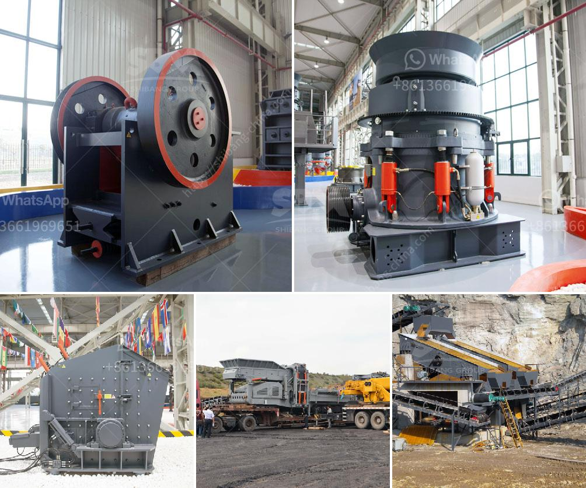

<h3>talc raymond grinding mill</h3>
Talc is one of the most commonly used minerals in various industries. It is widely recognized for its softness, versatility, and resistance to heat and electricity. In its natural form, talc ore is primarily composed of magnesium, silicon, and oxygen. To unlock its full potential, talc needs to be processed into a fine powder.

One popular method of talc powder production is grinding. The talc ore is crushed, ground, and processed into a fine powder. The choice of talc grinding mill is crucial in ensuring the quality and output of the final product. To choose the right mill for your needs, consider the following key factors:

1. Mill Types: There are several types of talc grinding mills available, including ball mill, jet mill, vertical roller mill, high-pressure grinding mill, and Raymond mill. Each type of mill has its own set of benefits and drawbacks and, therefore, must be carefully evaluated before making a selection.

2. Mill Capacity: The capacity of the mill must align with the desired production volume. It is important to choose a mill that can handle the required talc throughput without compromising on efficiency or quality. The capacity of talc Raymond grinding mills can range from 1-20 tons per hour.

3. Fineness: The fineness of the talc powder depends on the specific requirements for its end-use. Different industries demand varying levels of fine or coarse talc particles. Some applications, such as cosmetics, require a finer talc powder, while others, such as rubber and ceramics, may require coarser particles. The selected mill should have the capability to achieve the desired talc particle size distribution.

4. Energy Consumption: Energy efficiency is an important consideration when selecting a talc grinding mill. Mills with higher energy consumption can be more costly to operate. It is crucial to choose a mill that strikes a balance between maximizing energy savings and maintaining optimal performance.

Among the various types of talc grinding mills, the Raymond mill is widely recognized for its high productivity and efficiency in grinding talc. It is a versatile mill that efficiently pulverizes and classifies talc, bringing a number of benefits to various industries.

Raymond grinding mills utilize advanced grinding technology combined with advanced material handling to ensure efficient and reliable operation. The grinding roller and grinding ring are designed in a trapezoidal structure, which reduces the slip speed of the grinding ring, prolongs the grinding time, and enhances the overall grinding efficiency.

Additionally, the advanced controlling system of the Raymond mill allows for precise control over the grinding process, ensuring consistent particle size distribution and superior product quality.

With its higher grinding force and better grinding efficiency, the Raymond mill can process talc to a finer and more uniform particle size, ensuring that the end product meets the desired specifications. Moreover, the Raymond mill has a smaller footprint, allowing for easier installation and maintenance.

In conclusion, the choice of the talc grinding mill is crucial in ensuring the quality and output of the final talc powder. With its advanced grinding technology, superior efficiency, and precise control over the grinding process, the talc Raymond grinding mill is an ideal machine for the talc powder production.
<h3>Contact us</h3><ul><li><strong>Whatsapp:&nbsp;<a href="https://wa.me/8613661969651">+8613661969651</a></strong></li><li><a href="https://swt.shibang-china.com/?git&amp;zhl&amp;talc raymond grinding mill"><strong>Online Service(chat now)</strong></a></li></ul><h3>Related</h3><ul><li><a href='coal powder plant.md'>coal powder plant</a></li><li><a href='stone crusher owners of khurda.md'>stone crusher owners of khurda</a></li><li><a href='gypsum powder production business plan.md'>gypsum powder production business plan</a></li><li><a href='iron ore crushing plant setup cost in india.md'>iron ore crushing plant setup cost in india</a></li><li><a href='how much is jaw crusher.md'>how much is jaw crusher</a></li></ul>