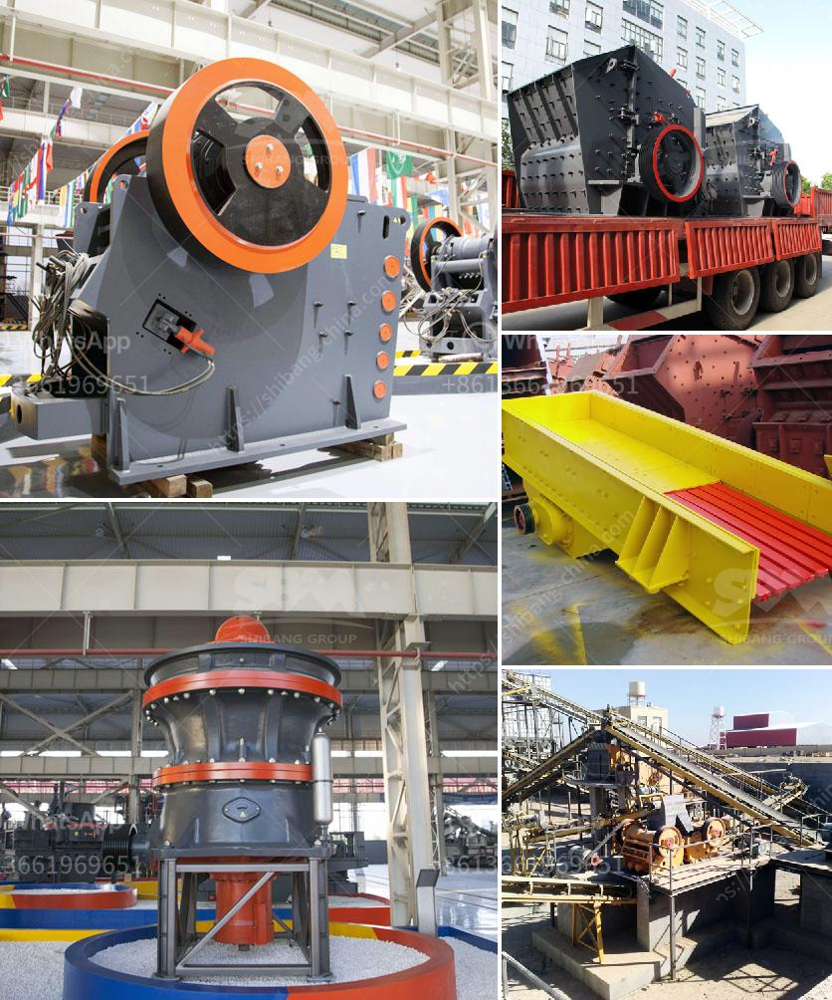

<h3>talcum powder philling machine</h3>
In the fast-paced world of packaging, efficiency and precision are key. Manufacturers are constantly on the lookout for innovative machinery that can streamline the packaging process and ensure that their products are packaged accurately. One such revolutionary machine is the Talcum Powder Filling Machine, which has gained significant popularity in recent years. This advanced equipment not only enhances productivity but also ensures perfect powder filling, making it an indispensable tool for manufacturing companies in various industries.

The talcum powder filling machine is specifically designed to handle the unique requirements of talcum powder packaging. Talcum powder is a fine, soft powder that is widely used in various cosmetic and personal care products. Its delicate nature requires utmost care during the packaging process to prevent spillage and product waste. The advanced design of the talcum powder filling machine addresses these concerns and provides an efficient and accurate solution.

One of the key features of the talcum powder filling machine is its ability to handle different packaging sizes and configurations. This flexibility allows manufacturers to cater to diverse customer demands, ensuring that their products reach the market in various sizes and forms. Whether it is small sachets, containers, or larger bulk packaging, the machine adapts to different formats seamlessly, reducing the need for multiple machines or manual adjustments.

Accuracy is paramount when it comes to powder filling. The talcum powder filling machine employs advanced technology to achieve precise filling, minimizing product wastage and ensuring consistent weight and volume in each package. Modern machines are equipped with advanced sensors and controls that monitor and adjust the filling process in real-time. This feature helps maintain a high level of accuracy, regardless of variations in powder density or packaging container size.

Furthermore, the talcum powder filling machine is designed with user-friendly features, making it easy to operate and maintain. Its intuitive interface and efficient mechanisms reduce the learning curve for operators, enabling them to quickly adapt to the machine's operation. Additionally, the machine's modular design and easy access to components simplify cleaning and maintenance, minimizing downtime and maximizing productivity.

Another significant advantage of the talcum powder filling machine is its ability to maintain a hygienic packaging environment. Talcum powder is often used in cosmetic and personal care products that are meant to be applied directly to the skin. To ensure the safety and integrity of these products, it is crucial to maintain a clean packaging environment. The machine's design incorporates features such as dust extraction systems and sealed filling stations that prevent contaminants from entering the packaging process, thereby preserving product quality and safety.

In conclusion, the talcum powder filling machine has revolutionized the packaging industry by providing an efficient, accurate, and hygienic solution for manufacturers. Its ability to handle diverse packaging sizes, precise filling capabilities, user-friendly design, and maintenance of a clean environment have made it an indispensable tool in the production of talcum powder-based products. As technology continues to advance, we can expect further enhancements and innovations in powder filling machinery, improving efficiency, and quality in the packaging industry.
<h3>Contact us</h3><ul><li><strong>Whatsapp:&nbsp;<a href="https://wa.me/8613661969651">+8613661969651</a></strong></li><li><a href="https://swt.shibang-china.com/?git&amp;zhl&amp;talcum powder philling machine"><strong>Online Service(chat now)</strong></a></li></ul><h3>Related</h3><ul><li><a href='jaw crusher machine for sale.md'>jaw crusher machine for sale</a></li><li><a href='roller mill cement price.md'>roller mill cement price</a></li><li><a href='hammer mill for ldpe grinding.md'>hammer mill for ldpe grinding</a></li><li><a href='portable rock crusher.md'>portable rock crusher</a></li><li><a href='used crusher for sale in pakistan.md'>used crusher for sale in pakistan</a></li></ul>