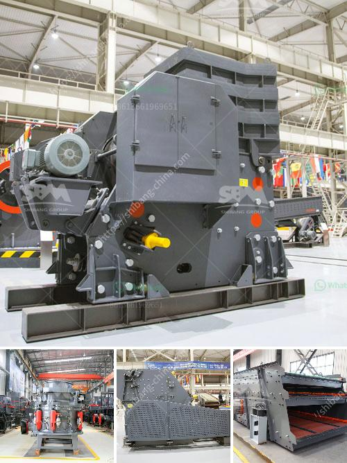

<h3>tanzania gold crusher price</h3>
Tanzania, located in East Africa, is known for its rich mineral resources, particularly gold. The country is one of the largest producers of gold in Africa, and it has attracted substantial investment in the mining sector. To extract and process gold, a crucial step is crushing the ore into smaller pieces, which increases its surface area for further processing. In this article, we will explore the gold crusher price in Tanzania and its implications for the mining industry.

The price of a gold crusher in Tanzania can vary depending on several factors such as the type, capacity, and efficiency of the crusher. Currently, crushers are available in various sizes and specifications, ranging from small manual crushers to large automated machines. The price range for a gold crusher in Tanzania can start from a few thousand dollars and go up to millions of dollars for high-capacity automated crushers.

Investing in a gold crusher can be a significant step for mining companies in Tanzania. The efficiency and productivity of the crusher can impact the overall profitability of the operation. A well-designed crusher with advanced features can help increase the throughput, reduce downtime, and minimize operating costs. Therefore, it is crucial for mining companies to carefully evaluate the price, performance, and reliability of different crusher options available in the market.

The gold crusher price in Tanzania also needs to be considered in the context of the country's infrastructure and economic conditions. Tanzania has made significant progress in improving its infrastructure, but challenges still remain, especially in remote mining areas where roads and power supply may be limited. Mining companies need to factor in the transportation and installation costs when considering the crusher price. Additionally, macroeconomic factors such as exchange rates, inflation, and government policies can affect the overall cost of mining operations.

Despite the potential challenges, investing in a gold crusher in Tanzania can offer lucrative opportunities for mining companies. The global demand for gold continues to be strong, and Tanzania's favorable geological conditions make it an attractive destination for gold exploration and production. With proper planning and investment, the mining industry in Tanzania can contribute significantly to the country's economic growth and create employment opportunities for the local workforce.

To ensure the sustainable development of the mining industry, it is essential for mining companies to prioritize responsible and ethical mining practices. This includes complying with environmental regulations, respecting local communities, and promoting safety standards for their workforce. Investing in state-of-the-art crushers that are designed with environmental considerations in mind can minimize the impact of mining on the surrounding ecosystems.

In conclusion, the gold crusher price in Tanzania is a crucial factor for mining companies looking to extract gold from the country's rich deposits. While the price can vary depending on various factors, investing in a well-designed and efficient crusher can increase the overall productivity and profitability of mining operations. However, mining companies must also consider the country's infrastructure, economic conditions, and environmental responsibilities when evaluating the crusher price. By prioritizing responsible mining practices, Tanzania can unlock the full potential of its mining industry and contribute to its long-term sustainable development.
<h3>Contact us</h3><ul><li><strong>Whatsapp:&nbsp;<a href="https://wa.me/8613661969651">+8613661969651</a></strong></li><li><a href="https://swt.shibang-china.com/?git&amp;zhl&amp;tanzania gold crusher price"><strong>Online Service(chat now)</strong></a></li></ul><h3>Related</h3><ul><li><a href='manufacturer of conveyor belts.md'>manufacturer of conveyor belts</a></li><li><a href='aggregates crusher philippines.md'>aggregates crusher philippines</a></li><li><a href='crushed sand manufacturing.md'>crushed sand manufacturing</a></li><li><a href='granite mining business plan.md'>granite mining business plan</a></li><li><a href='tonnes per year cement plant machinary.md'>tonnes per year cement plant machinary</a></li></ul>