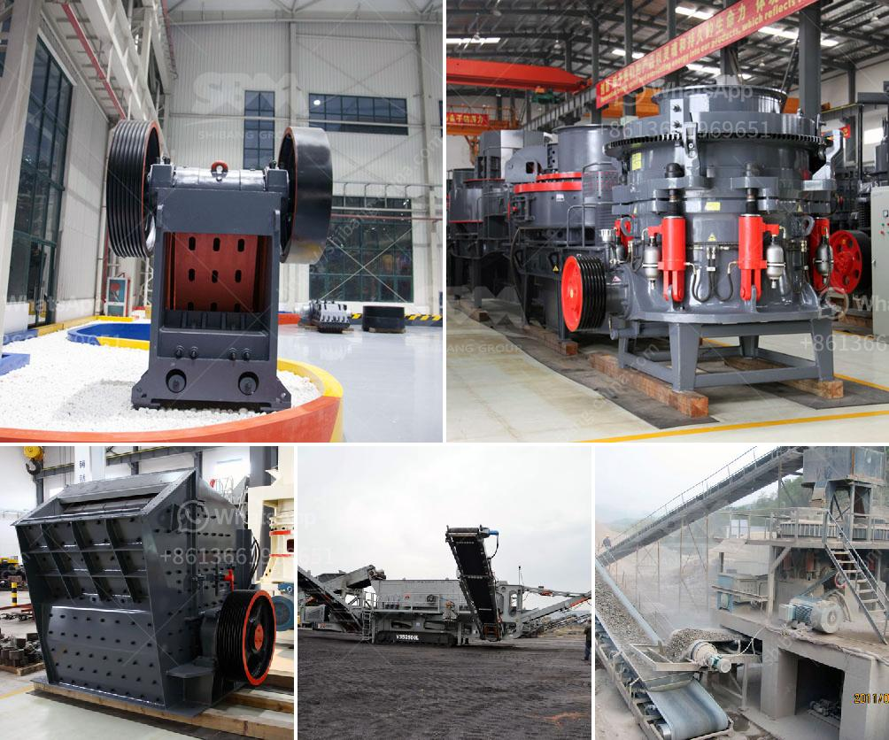

<h3>the process of limestone</h3>
Limestone is a sedimentary rock composed mainly of calcium carbonate (CaCO3). It is formed from the remains of marine organisms such as coral and shells, as well as from the deposition of calcium carbonate from bodies of water, such as rivers and lakes. Over millions of years, the accumulation of calcium carbonate and other minerals creates vast limestone formations that can be found all over the world.

The extraction of limestone begins with the process of quarrying, in which huge machines called crushers break down the limestone into smaller pieces. Once broken down, they are loaded into trucks and transported to a processing plant for further crushing and screening.

The process of quarrying limestone varies depending on the type of limestone being extracted. The most commonly used methods are surface mining, open-pit mining, and underground mining. Surface mining involves the removal of vegetation, soil cover, and overlying rock strata to access the limestone deposits. Large mechanical shovels and trucks are used to extract the limestone, which is then transported to the processing plant.

Once at the processing plant, the limestone goes through a series of crushing, screening, and washing processes to produce a variety of products such as aggregates, lime, and cement. The crushed limestone is then screened and classified into different sizes and specifications. This process ensures that the final product meets the required quality standards for various applications.

One of the key products derived from limestone is aggregates, which are used in construction and infrastructure projects. Aggregates are produced by crushing and screening the limestone into different sizes and shapes. They are commonly used in the production of concrete, asphalt, and road base materials.

Limestone is also used in the production of lime, which is obtained by heating limestone at high temperatures (around 900-1100°C) in a kiln. This process, called calcination, results in the release of carbon dioxide (CO2) and the formation of quicklime (calcium oxide, CaO). Quicklime can be further processed to produce hydrated lime by adding water. Lime is widely used in various industries such as construction, agriculture, and manufacturing processes.

Another important application of limestone is in the production of cement. Cement is made by mixing limestone with other materials, such as clay or shale, and heating them at high temperatures. This process, known as cement kiln, results in the formation of clinker, which is then ground into a fine powder to produce cement. Cement is a key ingredient in the construction industry and is used to make concrete, mortar, and other building materials.

In conclusion, the process of limestone involves the extraction, crushing, screening, and processing of the rock to produce various products such as aggregates, lime, and cement. It is a vital resource used in diverse industries and plays a significant role in infrastructure development. The quarrying and processing of limestone emphasize the importance of sustainable practices to minimize environmental impact and ensure the availability of this valuable resource for future generations.
<h3>Contact us</h3><ul><li><strong>Whatsapp:&nbsp;<a href="https://wa.me/8613661969651">+8613661969651</a></strong></li><li><a href="https://swt.shibang-china.com/?git&amp;zhl&amp;the process of limestone"><strong>Online Service(chat now)</strong></a></li></ul><h3>Related</h3><ul><li><a href='ball mill ball feeders.md'>ball mill ball feeders</a></li><li><a href='price of crusher machine for sale in nigeria.md'>price of crusher machine for sale in nigeria</a></li><li><a href='quratz crusher price.md'>quratz crusher price</a></li><li><a href='mobile crusher supplier.md'>mobile crusher supplier</a></li><li><a href='bresting and crushing concrete philippines.md'>bresting and crushing concrete philippines</a></li></ul>