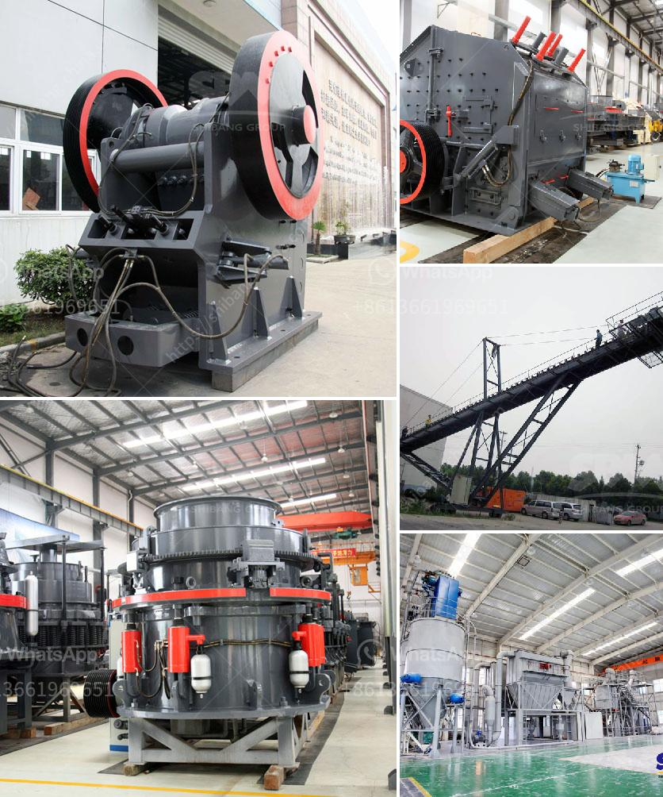

<h3>three ring micro powder mill</h3>
Three-ring micro powder mill, also known as ultrafine grinding mill, has been widely used in the fine grinding of materials such as dolomite, calcite, talc, bentonite, kaolin, graphite, etc. It has won the favor and praise of customers due to its excellent performance and high cost performance. In this article, we will explore the three-ring micro powder mill in more detail.

The three-ring micro powder mill is mainly composed of a host machine, analysis machine, blower, finished product cyclone separator, plumbing device, motor, and other components. The main engine consists of a rack, inlet volute, blade, grinding roller, grinding ring, casing, etc. The materials are fed into the main engine through the feeding port and fall into the grinding chamber. Under the action of centrifugal force, the materials are scooped up by the blade and sent to the grinding roller and grinding ring to be ground and pulverized.

What sets the three-ring micro powder mill apart from other mills is its advanced technology and innovative design. Its grinding roller and grinding ring are forged with special materials, which greatly improves the utilization rate and service life of the equipment. The grinding roller and grinding ring are not in direct contact with each other during operation, thus avoiding the wear and tear caused by metal friction and ensuring the cleanliness of the final powder. Meanwhile, the adoption of pulse dust collector and muffler greatly reduces the dust pollution and noise generated during the grinding process, creating a clean and quiet working environment.

The three-ring micro powder mill has the advantages of small footprint, low investment cost, and energy saving. The whole set of equipment is closely integrated, with strong system adaptability and flexible configuration. Different fineness requirements can be achieved by adjusting the speed of the motor, the size of the blade, and the gap between the grinding roller and the grinding ring. Moreover, the finished product has uniform fineness, excellent particle shape, and high quality. It can meet the needs of various industries such as metallurgy, mining, chemical industry, building materials, and other fields.

In conclusion, the three-ring micro powder mill is a high-quality and efficient grinding equipment. It integrates crushing, grinding, grading, and powder collection into one machine. With its advanced technology, reliable performance, and cost-effective advantages, it has become an ideal choice for fine grinding and processing of various non-metallic minerals. As an innovative product, the three-ring micro powder mill will continue to bring more convenience and benefits to customers in the future.
<h3>Contact us</h3><ul><li><strong>Whatsapp:&nbsp;<a href="https://wa.me/8613661969651">+8613661969651</a></strong></li><li><a href="https://swt.shibang-china.com/?git&amp;zhl&amp;three ring micro powder mill"><strong>Online Service(chat now)</strong></a></li></ul><h3>Related</h3><ul><li><a href='cost of equipment used in mining lead ore.md'>cost of equipment used in mining lead ore</a></li><li><a href='3 tom capecity ball mill.md'>3 tom capecity ball mill</a></li><li><a href='sand wash plant 50tph.md'>sand wash plant 50tph</a></li><li><a href='stone crusher plant in uae.md'>stone crusher plant in uae</a></li><li><a href='aluminum slag processing plant in germany.md'>aluminum slag processing plant in germany</a></li></ul>