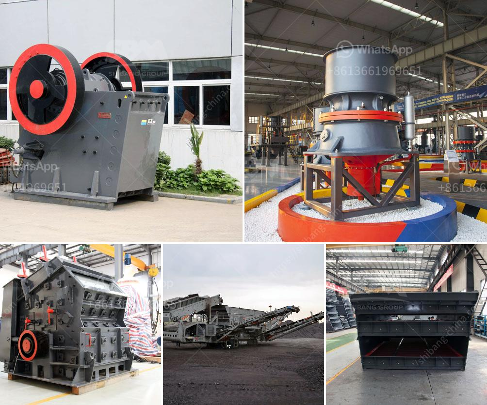

<h3>to see models of vibrating screens</h3>
Vibrating screens are crucial equipment in a variety of industries, ranging from mining and construction to food processing and pharmaceuticals. These screens are designed to separate and segregate particles according to specific size and shape, ensuring the efficient processing of materials.

When it comes to selecting a vibrating screen, it is important to consider various factors such as the type of material being processed, desired capacity, and specific requirements of the operation. Luckily, there is a wide range of vibrating screen models available to cater to different needs.

One popular vibrating screen model is the linear vibrating screen. This type of screen uses a linear motion to convey the material along the screen surface, resulting in efficient screening and high output. Linear vibrating screens are often used in industries where precise separation of fine particles is required.

Another commonly used vibrating screen model is the circular vibrating screen. As the name suggests, the circular motion of this type of screen helps to evenly distribute the material across the screen surface, improving screening efficiency. Circular vibrating screens are often used in industries where large capacity and high-performance screening are needed.

For applications requiring fine screening, the high-frequency vibrating screen is an ideal choice. This type of screen operates at a high frequency, allowing for the effective separation of smaller particles. High-frequency vibrating screens are commonly used in mineral processing and coal preparation industries.

In addition to these models, there are other specialized vibrating screens available, such as inclined vibrating screens, dewatering screens, and multi-deck vibrating screens. These screens cater to specific industry requirements and offer unique features that enhance the screening process.

In conclusion, selecting the right vibrating screen model is crucial for efficient and effective material processing. Considering factors such as material type, desired capacity, and specific requirements will help in choosing the appropriate model. Whether it is linear, circular, high-frequency, or specialized screens, there is a wide range of models to suit every industry need.
<h3>Contact us</h3><ul><li><strong>Whatsapp:&nbsp;<a href="https://wa.me/8613661969651">+8613661969651</a></strong></li><li><a href="https://swt.shibang-china.com/?git&amp;zhl&amp;to see models of vibrating screens"><strong>Online Service(chat now)</strong></a></li></ul><h3>Related</h3><ul><li><a href='zevith simple stone crushers kenya.md'>zevith simple stone crushers kenya</a></li><li><a href='cement plants capacities of lafarge in nigeria.md'>cement plants capacities of lafarge in nigeria</a></li><li><a href='mobile crushing plant hire product.md'>mobile crushing plant hire product</a></li><li><a href='limestone processing plant in benin.md'>limestone processing plant in benin</a></li><li><a href='2d model ball mill.md'>2d model ball mill</a></li></ul>