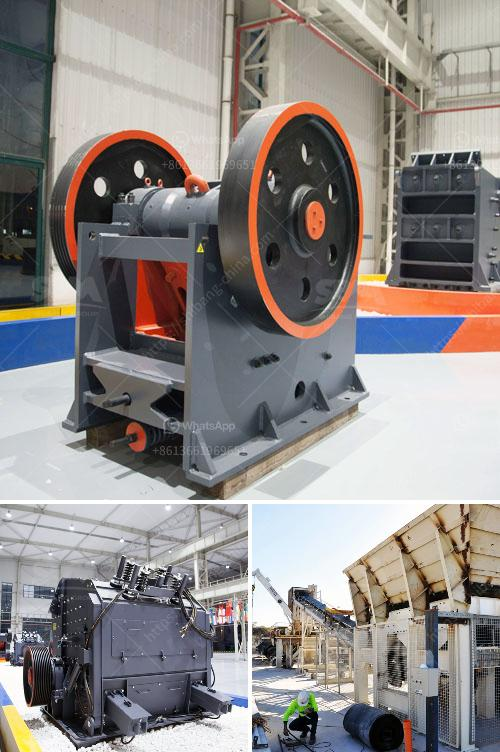

<h3>to separate manganese and iron ore</h3>
Manganese and iron ores are both minerals that have abundant reserves in the Earth's crust. They are often intertwined, which makes the separation process complex and costly. However, scientists and engineers have developed innovative technologies to separate these two valuable minerals efficiently. In this article, we will explore the methods used to separate manganese and iron ore.

One of the most effective methods to separate manganese and iron ore is magnetic separation. This technique relies on the magnetic properties of both minerals to extract them from a mixture. First, the ore is crushed into smaller particles. Then, a strong magnetic field is applied to attract the magnetic mineral. In this case, iron ore is paramagnetic, meaning it is attracted to the magnetic field, while manganese ore is diamagnetic, meaning it is repelled by the magnetic field. By adjusting the intensity of the magnetic field, it is possible to selectively separate the two minerals.

Gravity separation is another commonly used method to separate manganese and iron ore. This process utilizes the differences in density between the minerals. After crushing the ore, it is placed on a shaking table, where particles are subjected to a combination of a downward motion and a flow of water. Lighter minerals, such as manganese ore, are carried away by the flowing water, while heavier minerals, such as iron ore, remain on the shaking table. By adjusting the tilt of the table and the speed of the water flow, it is possible to separate the two minerals efficiently.

High-intensity air separation is a newer technology that is gaining traction in the industry. It utilizes the differences in aerodynamic properties between manganese and iron ore particles to separate them. In this process, the ore is first crushed into fine particles. Then, a high-velocity air stream is passed through the mixture, causing the lighter manganese ore particles to be carried away while the heavier iron ore particles fall. By adjusting the speed and direction of the air flow, it is possible to achieve a high separation efficiency.

Froth flotation, a commonly used technique in mineral processing, can also be employed to separate manganese and iron ore. In this process, chemicals called collectors are added to the ore mixture, which selectively attaches to one mineral while repelling the other. Air bubbles are then introduced to the mixture, and the minerals that are attached to the bubbles rise to the surface in a froth. The froth is then skimmed off, separating the minerals. By selecting the appropriate collectors and adjusting the flotation conditions, efficient separation of manganese and iron ore can be achieved.

In conclusion, the separation of manganese and iron ore is a complex process due to their intertwined nature. However, several methods have been developed to efficiently separate these two valuable minerals. Magnetic separation, gravity separation, high-intensity air separation, and froth flotation are some of the commonly used techniques. Each method has its advantages and limitations, and the choice depends on the specific characteristics of the ore mixture. As technology continues to advance, the efficiency of separation processes is expected to improve, maximizing the recovery of these valuable minerals.
<h3>Contact us</h3><ul><li><strong>Whatsapp:&nbsp;<a href="https://wa.me/8613661969651">+8613661969651</a></strong></li><li><a href="https://swt.shibang-china.com/?git&amp;zhl&amp;to separate manganese and iron ore"><strong>Online Service(chat now)</strong></a></li></ul><h3>Related</h3><ul><li><a href='screening plant for hire south africa.md'>screening plant for hire south africa</a></li><li><a href='roll mill machine.md'>roll mill machine</a></li><li><a href='charcoal crusher kenya.md'>charcoal crusher kenya</a></li><li><a href='river stone processing plant.md'>river stone processing plant</a></li><li><a href='stone crusher vibrating screen for sale.md'>stone crusher vibrating screen for sale</a></li></ul>