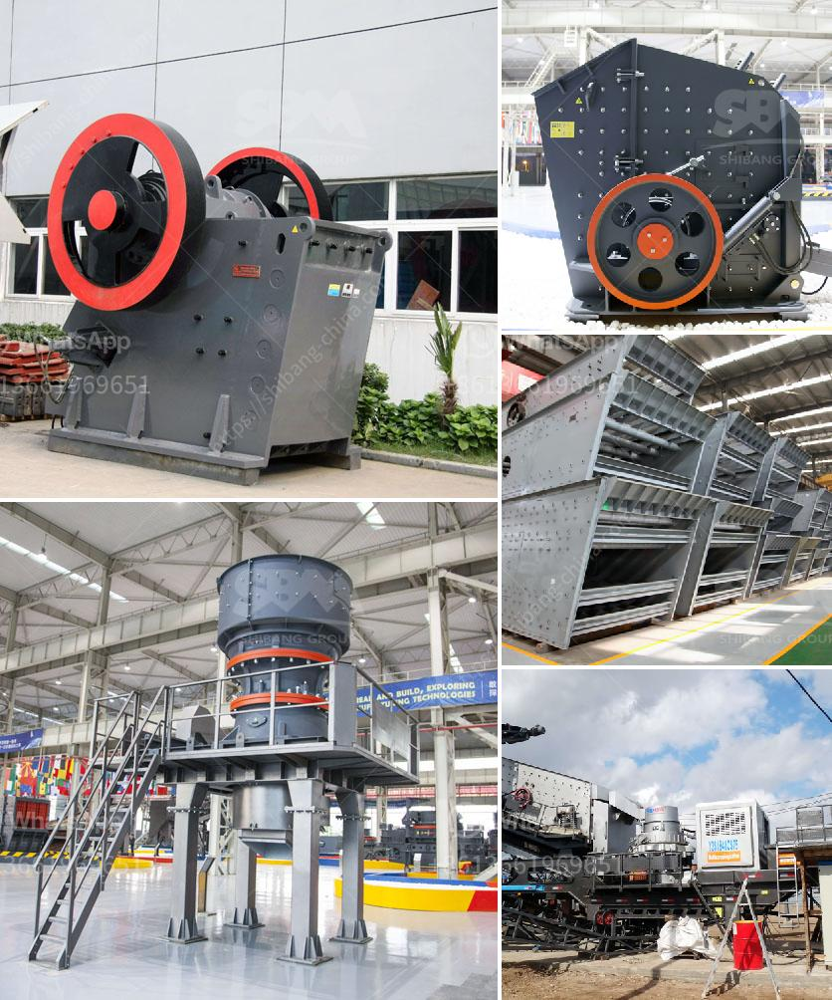

<h3>to set up a stone crushing plant in bhutan</h3>
Stone crushing plant is one-stop crushing installation, which can be used for rock crushing, garbage crushing, building materials crushing and other similar operations. Crushing plants may be either fixed or mobile. A crushing plant has different stations (primary, secondary, tertiary, ...) where different crushing, selection and transport cycles are done in order to obtain different stone sizes, as per the requirement.

Stone crushing is the two-stage process. In the first stage, crush the 175mm stone to about 50mm. Thereafter, fit the crusher with a conversion kit to enable granulation of 5 to 20mm. Then screen the crushed material by the rotary screen. Unit location is a major factor for stone crusher plant business.

It is advantageous if the crushed stone unit is set up near the quarries where the granite boulders of various sizes are available for the crushing unit. The wastage from the granite industry will be of much use to the crushed stone unit.

Stone crushing plant can be installed easily and there are many advantages of participating in the industry. They are:

- Investing in the stone-crushing business grants advantages like a faster return on investment, reduced cost, higher output and establishment of market presence.

- The initial capital investment is modest, making it a perfect solution for small and medium-sized businesses.

- Employment generation: The plant can create employment opportunities for both skilled and unskilled labor.

- Tax revenue: The plant can help in generating revenue for the government as taxes paid by the plant will contribute to the country's economy.

- Local development: The establishment of a stone crushing plant will provide local materials for infrastructure development, thereby boosting the local economy.

In summary, a stone crushing plant in Bhutan is feasible and profitable and offers many benefits to the local population, including employment opportunities, tax revenue, and local development.
<h3>Contact us</h3><ul><li><strong>Whatsapp:&nbsp;<a href="https://wa.me/8613661969651">+8613661969651</a></strong></li><li><a href="https://swt.shibang-china.com/?git&amp;zhl&amp;to set up a stone crushing plant in bhutan"><strong>Online Service(chat now)</strong></a></li></ul><h3>Related</h3><ul><li><a href='how to build a stone crusher.md'>how to build a stone crusher</a></li><li><a href='equipment used for crushing in activated carbon.md'>equipment used for crushing in activated carbon</a></li><li><a href='nigeria grinding mill.md'>nigeria grinding mill</a></li><li><a href='bauxite processing plant project cost.md'>bauxite processing plant project cost</a></li><li><a href='used sweco screening equipment for sale.md'>used sweco screening equipment for sale</a></li></ul>