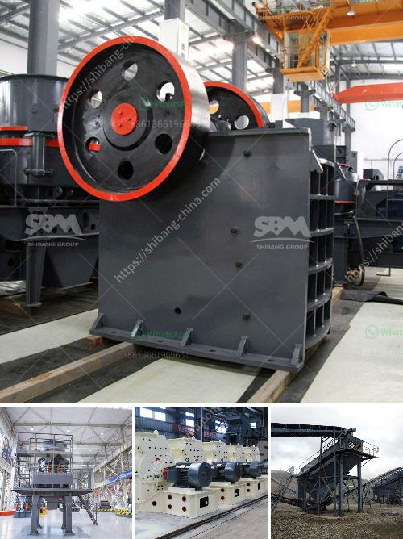

<h3>tonnes per year cement plant machinary</h3>
A cement plant is a vital piece of infrastructure for any country's construction industry. It is responsible for producing cement, a binding material that is used in the manufacturing of concrete, an essential component in the construction of buildings, roads, bridges, and other structures. To meet the growing demand for cement, high-quality machinery is required to ensure efficient production processes.

One crucial aspect of a cement plant's machinery is its capacity. The term "tonnes per year" refers to the amount of cement that a plant can produce within a specific timeframe. For instance, a 100-tonnes-per-year cement plant can produce 100 tonnes of cement within a year. In contrast, a 300-tonnes-per-year cement plant can produce 300 tonnes of cement annually.

To achieve these production capacities, advanced machinery is employed in cement plants. Key machinery includes crushers, raw material mills, kilns, clinker grinders, and cement mills. These machines work in synchronization to transform raw materials such as limestone, clay, and iron ore into cement.

The machinery used in cement plants is usually heavy-duty and designed to withstand the harsh conditions of cement production. It requires regular maintenance to ensure optimal performance and longevity. Skilled technicians are responsible for monitoring and maintaining these machines to minimize downtime and maximize productivity.

In recent years, there have been advancements in cement plant machinery to improve efficiency and reduce environmental impacts. For example, modern cement plants integrate technologies such as automation, artificial intelligence, and digitalization to optimize plant operations. These technologies not only enhance production but also contribute to a more sustainable and eco-friendly cement industry.

In conclusion, tonnes per year cement plant machinery plays a critical role in meeting the global demand for cement. With its capacity ranging from 100 to 300 tonnes per year, it ensures the efficient production of this vital construction material. Modern machinery equipped with advanced technologies is essential for ensuring smooth operations, high productivity, and sustainability in the cement industry.
<h3>Contact us</h3><ul><li><strong>Whatsapp:&nbsp;<a href="https://wa.me/8613661969651">+8613661969651</a></strong></li><li><a href="https://swt.shibang-china.com/?git&amp;zhl&amp;tonnes per year cement plant machinary"><strong>Online Service(chat now)</strong></a></li></ul><h3>Related</h3><ul><li><a href='types of conveyor belts.md'>types of conveyor belts</a></li><li><a href='quartz stone crusher manufacturing machines.md'>quartz stone crusher manufacturing machines</a></li><li><a href='business plan south africa stone crusher.md'>business plan south africa stone crusher</a></li><li><a href='crushing plant for irion ore.md'>crushing plant for irion ore</a></li><li><a href='bentonite granuels machines gujrat.md'>bentonite granuels machines gujrat</a></li></ul>