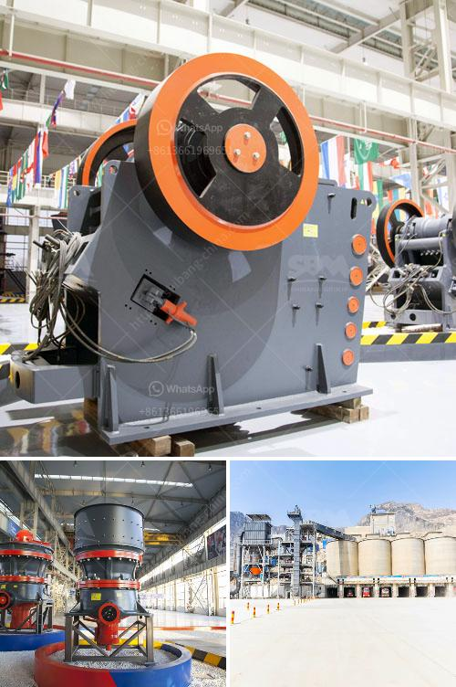

<h3>top roller mills for sale</h3>
When it comes to industrial grinding processes, roller mills have proven to be highly efficient and reliable machines. These machines are widely used in the mining, construction, and chemical industries for milling various materials into a fine powder or a specified size. If you are in the market for a roller mill, this article will provide you with a guide to the top roller mills for sale.

1. RMS Roller Grinder: Known for its robust construction and high-quality engineering, RMS roller mills are a top choice for many industries. With a wide range of options available, these mills can handle all types of materials, from grains and corn to minerals and chemicals. RMS roller mills are also known for their easy maintenance, ensuring that downtime is minimized.

2. CPM Roskamp Champion: CPM is a well-known brand in the field of roller mills. Roskamp Champion roller mills are built to last and offer superior performance. These mills are available in a variety of sizes and configurations to suit different applications. With advanced features such as a grinding chamber with multiple rolls, precise control of roll speed, and adjustable roll gap, CPM roller mills deliver consistent and reliable results.

3. Henke Buffalo: Henke Buffalo roller mills are known for their durability and efficiency. These mills are built to handle heavy-duty applications and can deliver consistently high-quality grinding results. Henke Buffalo roller mills are available in various sizes and configurations, making it easy to find the right mill for your specific needs. Additionally, these mills are designed with ease of use and maintenance in mind, ensuring that they can be operated efficiently and reliably.

4. Automatic Equipment Manufacturing Co.: Automatic roller mills offer a wide range of features and options to meet different grinding requirements. These mills are known for their advanced automation, allowing for precise control and consistent performance. Automatic roller mills are also designed with durability and ease of maintenance in mind, ensuring that they can withstand heavy-duty use and minimize downtime.

When selecting a roller mill for your specific application, there are several factors to consider. First, determine the type of material you will be milling and its characteristics, such as hardness and moisture content. This will help you choose a mill with the appropriate specifications. It is also essential to consider the capacity and throughput requirements of your operation to ensure that the chosen mill can handle the desired workload. Finally, consider the maintenance requirements, as regular maintenance is crucial for the longevity and reliability of your roller mill.

In conclusion, roller mills are vital machines in various industries, providing efficient and reliable grinding solutions. The top roller mills for sale, including RMS Roller Grinder, CPM Roskamp Champion, Henke Buffalo, and Automatic Equipment Manufacturing Co., offer exceptional quality, performance, and durability. By considering the specific requirements of your application and the necessary features and specifications, you can choose the right roller mill that will meet your needs and deliver optimal results.
<h3>Contact us</h3><ul><li><strong>Whatsapp:&nbsp;<a href="https://wa.me/8613661969651">+8613661969651</a></strong></li><li><a href="https://swt.shibang-china.com/?git&amp;zhl&amp;top roller mills for sale"><strong>Online Service(chat now)</strong></a></li></ul><h3>Related</h3><ul><li><a href='price crusher mill price stone crusher.md'>price crusher mill price stone crusher</a></li><li><a href='quarry equipment.md'>quarry equipment</a></li><li><a href='mobile stone crusher for sale in south africa.md'>mobile stone crusher for sale in south africa</a></li><li><a href='ceramic crushing production line.md'>ceramic crushing production line</a></li><li><a href='super fine powder grinder.md'>super fine powder grinder</a></li></ul>