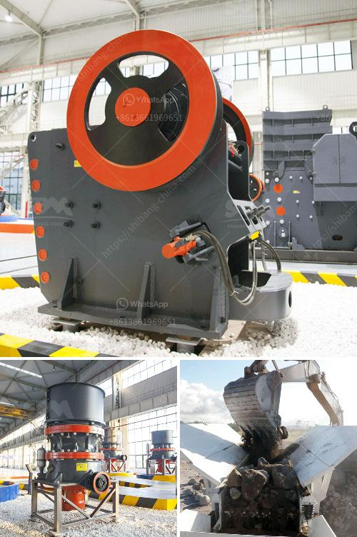

<h3>top stone crusher companies in india</h3>
Stone crusher machine plays a vital role in the mining industry as well as in the construction industry. The reliability, performance, and efficiency of these machines are crucial in order to meet the set standards of productivity and quality.

There are numerous stone crusher machines available in India. However, choosing a reliable and efficient one is an uphill task. Therefore, we have compiled this list of top stone crusher companies in India based on their market presence, customer feedback, and overall performance.

K. V. Metal Works is a reputed stone crushing machine manufacturer, offering a wide range of high-quality machines for varied applications. Their products are manufactured with the utmost precision and with the use of premium quality components.

Amarshiva Engineering Company is well-known among the top stone crusher manufacturers in India. They offer robust and efficient crushing machines to their clients. They have a team of talented and experienced professionals who understand the varying needs of their clients and design suitable stone crusher plants or equipment to meet those requirements.

Mewar Hitech Engineering Limited is one of the renowned stone crusher manufacturers in India which excels in offering supreme quality products. Their machines are designed to perform under extreme conditions, ensuring a smooth and consistent working process.

Propel Industries Private Limited is a renowned stone crusher manufacturer in India. Their machines are specifically designed to be cost-effective, reliable, and efficient. With their extensive experience in the industry, they understand the need for reliability, durability, and performance.

Nesans Mining and Automation Private Limited are one of the leading stone crusher manufacturers in India. They offer a wide range of crushers for all types of rock and stone crushing needs. These crushers are robust, durable, and feature excellent crushing capabilities.

Choosing the right stone crusher machine manufacturer is crucial for the success of any construction or mining project. With so many options available, it's important to review each company's products and services, as well as their reputation in the industry. By considering factors such as product quality, reliability, and customer satisfaction, you can ensure that you choose the best stone crusher company in India for your specific needs.
<h3>Contact us</h3><ul><li><strong>Whatsapp:&nbsp;<a href="https://wa.me/8613661969651">+8613661969651</a></strong></li><li><a href="https://swt.shibang-china.com/?git&amp;zhl&amp;top stone crusher companies in india"><strong>Online Service(chat now)</strong></a></li></ul><h3>Related</h3><ul><li><a href='nigeria raymond mill.md'>nigeria raymond mill</a></li><li><a href='top stone crusher companies in india.md'>top stone crusher companies in india</a></li><li><a href='marble processing plant in uae.md'>marble processing plant in uae</a></li><li><a href='200 ton mini cement plant project cost in india.md'>200 ton mini cement plant project cost in india</a></li><li><a href='italy rotary cement packing machine.md'>italy rotary cement packing machine</a></li></ul>