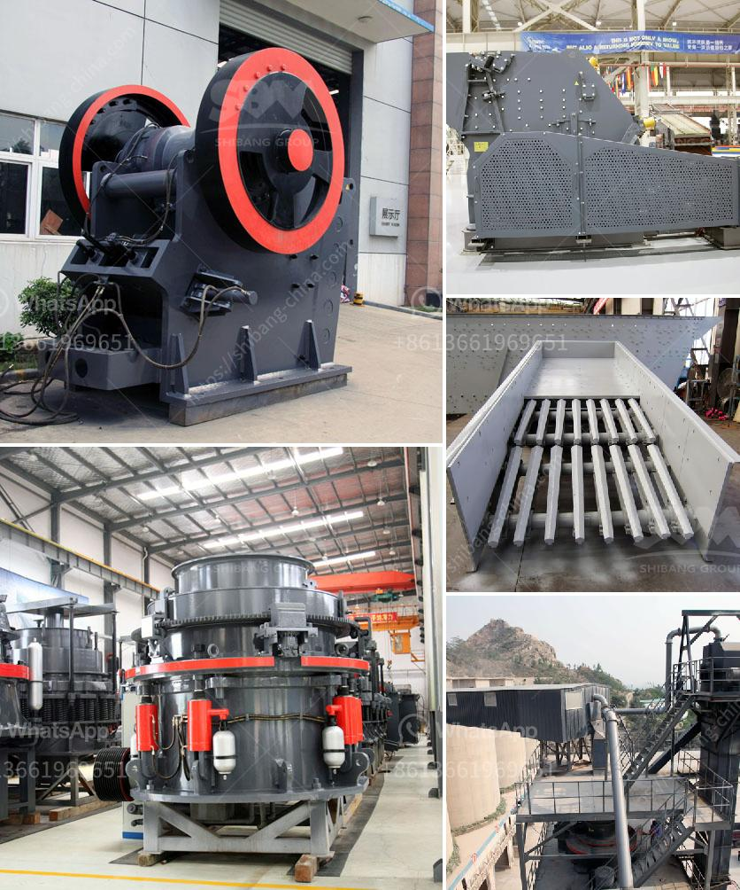

<h3>tpd cement grinding plant cost and project report</h3>
With the increasing demand for cement, most of the companies are opting for large capacity cement grinding plants, which require huge investments and pose a challenge for the feasibility of establishing a grinding unit. These plants have a capacity ranging from 100tpd to 3000tpd.

Cement grinding plants are designed with the latest vertical roller mills or ball mills, which are capable of grinding clinker and other additives such as slag, fly ash, pozzolana, and limestone in a single grinding unit. These cement grinding plants are modular and compact in design due to their smaller footprint and high level of automation. They can be easily installed and commissioned at a lower cost compared to the traditional grinding units.

The cost of setting up a TPD cement grinding unit can vary significantly depending on factors such as the size of the plant, equipment used, and project location. In general, the cost of setting up a TPD cement grinding plant ranges from around $1000 to $10000 per tonne of clinker grinding capacity. The cost estimation highly depends on whether the plant has integrated facilities or not. Integrated facilities include clinker production, grinding, and packing, whereas non-integrated facilities only include grinding and packing units.

A detailed project report (DPR) is essential for setting up a cement grinding unit. It provides financial analysis, market positioning, regulatory framework, production process, raw material requirements, costs, revenue projections, and profitability analysis. A well-prepared DPR helps in understanding the project feasibility and attracts potential investors.

1. Introduction: This section gives an overview of the project, including the company background, vision, and mission.

2. Market Analysis: This section provides detailed information on the cement market, including market size, growth prospects, demand-supply scenario, competition analysis, and market segmentation.

3. Technical Analysis: This section includes technical details of the cement grinding plant, such as the type of equipment, process flow diagram, energy consumption, and pollution control measures.

4. Financial Analysis: This section provides detailed financial projections, including the initial investment cost, project cost, sources of finance, revenue projections, operating costs, and profitability analysis.

5. Project Implementation Schedule: This section provides information on the project implementation timeline, including activities, milestones, and critical path analysis.

6. Risk Analysis: This section identifies potential risks and uncertainties associated with the project, along with mitigation measures.

7. Environmental Clearance: This section provides details on obtaining environmental clearance from regulatory authorities, including the process and requirements.

8. Conclusion: This section summarizes the project report, highlighting the key findings, benefits, and challenges.

In conclusion, setting up a TPD cement grinding plant involves significant investments, technical expertise, and regulatory clearances. However, with the increasing demand for cement, the high level of automation, and the compact design of these grinding units, they offer a cost-effective solution for the cement industry. Proper cost estimation and a detailed project report are crucial for attracting potential investors and ensuring the project's success.
<h3>Contact us</h3><ul><li><strong>Whatsapp:&nbsp;<a href="https://wa.me/8613661969651">+8613661969651</a></strong></li><li><a href="https://swt.shibang-china.com/?git&amp;zhl&amp;tpd cement grinding plant cost and project report"><strong>Online Service(chat now)</strong></a></li></ul><h3>Related</h3><ul><li><a href='equipment for grinding calcium carbonate.md'>equipment for grinding calcium carbonate</a></li><li><a href='barite mill saltillo.md'>barite mill saltillo</a></li><li><a href='mobile stone crusher for sale in south africa.md'>mobile stone crusher for sale in south africa</a></li><li><a href='small concrete crusher for sale.md'>small concrete crusher for sale</a></li><li><a href='cost of grizzly crusher.md'>cost of grizzly crusher</a></li></ul>