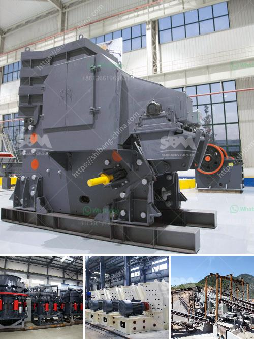

<h3>tph stone crushers with vsi in india</h3>
India is known for its thriving construction industry. The demand for robust infrastructure development and housing projects has led to the increased need for stone crushers. With a wide range of options available, the stone crushing industry in India has been witnessing immense growth. One such machine that has revolutionized the industry is the VSI (Vertical Shaft Impactor) crusher. This article aims to explore the advantages of this innovative stone crusher and shed light on its significance in shaping India's construction landscape.

A VSI crusher, also known as a vertical shaft impactor, is a type of impact crusher that utilizes the principle of collision and attrition to generate the finest form of crushed rock. The unique feature of a VSI crusher is its ability to produce highly cubical-shaped end products, making it an ideal choice for tertiary and quaternary crushing applications.

The VSI crusher ensures high-quality final products by producing crushed materials with a uniform particle size and cubical shape. This significantly improves the efficiency of downstream processes, such as screening and concrete production, resulting in higher production output.

TPH stone crushers with VSI in India are designed to handle a variety of rock types, making them highly adaptable. They excel in producing manufactured sand, well-graded aggregates, and industrial minerals essential for a range of construction projects, including roads, buildings, bridges, and more.

Stone crushers with VSI in India offer a cost-effective solution for reducing the overall construction costs. By producing fine aggregates with a VSI crusher, contractors can reduce the need for expensive natural sand, which is often scarce in many parts of India. Additionally, the reduced need for additional crushing stages helps save on energy consumption and operational costs.

VSI crushers are designed for maximum reliability and minimum maintenance in harsh operating conditions. Their robust construction and easily replaceable wear parts result in reduced downtime, ensuring an uninterrupted production flow in high-demand scenarios.

With growing concerns over environmental sustainability, the VSI crushers offer a greener alternative to traditional crushing methods. By producing manufactured sand from crushed rock, the demand for river sand can be reduced, mitigating the negative environmental impact associated with sand mining.

The adoption of TPH stone crushers with VSI technology in India has revolutionized the construction industry by allowing for the production of high-quality aggregates and manufactured sand. Their exceptional performance, cost-effectiveness, and sustainability make them indispensable in shaping the country's infrastructure development. As India continues to witness rapid urbanization and increased construction, the demand for TPH stone crushers with VSI is expected to soar. It is crucial for construction companies and infrastructure developers to embrace this innovative technology to meet the market demands efficiently.
<h3>Contact us</h3><ul><li><strong>Whatsapp:&nbsp;<a href="https://wa.me/8613661969651">+8613661969651</a></strong></li><li><a href="https://swt.shibang-china.com/?git&amp;zhl&amp;tph stone crushers with vsi in india"><strong>Online Service(chat now)</strong></a></li></ul><h3>Related</h3><ul><li><a href='marble crusher and grinding machinery.md'>marble crusher and grinding machinery</a></li><li><a href='conveyor belt pricing in malaysia.md'>conveyor belt pricing in malaysia</a></li><li><a href='about aggregate crusher plants.md'>about aggregate crusher plants</a></li><li><a href='coal crusher machine 5 ton per hours.md'>coal crusher machine 5 ton per hours</a></li><li><a href='marble and granite grinder and crusher.md'>marble and granite grinder and crusher</a></li></ul>