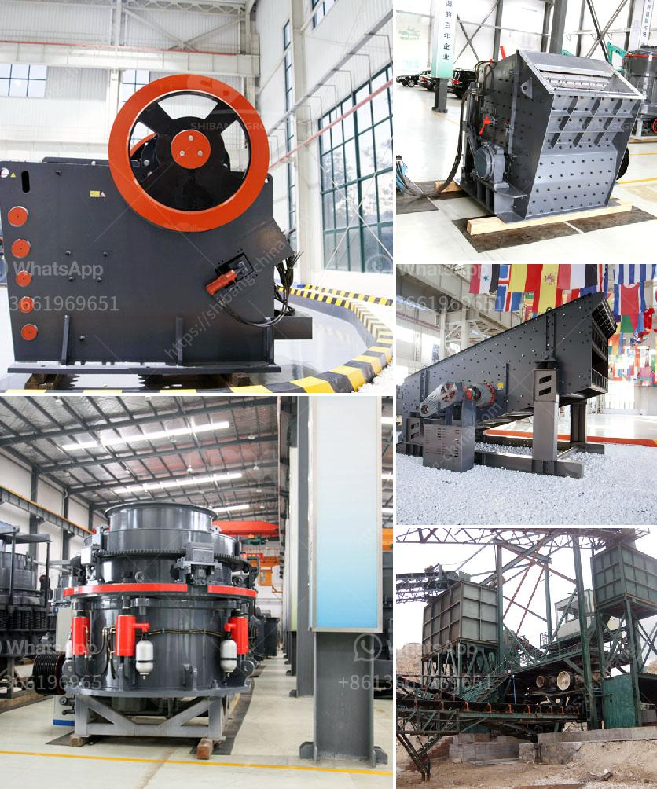

<h3>track mounted coal crushers indonesia</h3>
Track mounted coal crushers have been widely used in many coal mining projects in Indonesia, as well as other countries. They have been designed with advanced technology and possess great flexibility, making them ideal for any kind of terrain and work environment.

The track mounted coal crushers are compact and highly efficient, portable machines that are capable of breaking down coal into different sizes. This specially-engineered equipment is designed to perform under the toughest conditions, making it suitable for any type of mining operation.

One of the key features of track mounted coal crushers is their ability to move easily from one site to another. This mobility enables operators to transport the crushers to different locations within the mine, allowing for increased productivity and efficiency. The compact size of these crushers also makes them easy to maneuver and operate in tight spaces, further enhancing their usability.

In addition to their portability, track mounted coal crushers are equipped with powerful engines that provide high crushing capacities. This enables them to handle large volumes of coal, ensuring a steady supply to the processing plants. The crushers also incorporate advanced control systems, which allow operators to adjust the settings according to the desired product size and efficiently regulate the feed rate, ensuring optimal crushing performance.

Furthermore, track mounted coal crushers are designed to withstand harsh working conditions in the mining industry. They are built using heavy-duty materials and components that are resistant to wear and tear, ensuring longevity and durability. This significantly reduces the need for frequent maintenance and repairs, saving both time and money for operators.

In conclusion, track mounted coal crushers are an essential piece of equipment for coal mining projects in Indonesia. Their compact size, mobility, and high crushing capacities make them ideal for efficiently breaking down coal into different sizes. With their advanced technology and robust design, these crushers provide reliability and performance even in the toughest working conditions.
<h3>Contact us</h3><ul><li><strong>Whatsapp:&nbsp;<a href="https://wa.me/8613661969651">+8613661969651</a></strong></li><li><a href="https://swt.shibang-china.com/?git&amp;zhl&amp;track mounted coal crushers indonesia"><strong>Online Service(chat now)</strong></a></li></ul><h3>Related</h3><ul><li><a href='copper ore conveying system.md'>copper ore conveying system</a></li><li><a href='difference between sand and crushed stone powder.md'>difference between sand and crushed stone powder</a></li><li><a href='tanzania gold crusher price.md'>tanzania gold crusher price</a></li><li><a href='cost of grinding mills for building.md'>cost of grinding mills for building</a></li><li><a href='sand wash plant for sale.md'>sand wash plant for sale</a></li></ul>