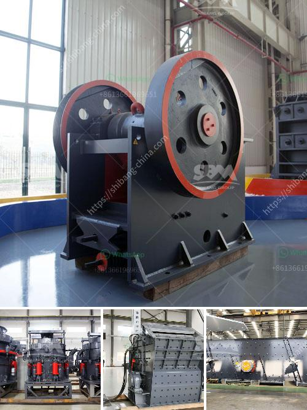

<h3>transport system in a mineral crusher</h3>
Transportation plays a vital role in the functioning of any industrial unit, and the mineral crusher industry is no exception. A mineral crusher is a machine that crushes minerals, rocks, and other materials into smaller pieces for further processing or use in various industries. However, the effective transport system within a mineral crusher unit is equally important to ensure smooth operations and increased productivity.

One of the primary aspects of an efficient transport system in a mineral crusher is the conveyance of raw materials to the machine. This involves establishing a well-planned infrastructure for transporting minerals and rocks from the mining site to the crusher. Depending on the distance and quantity, various modes of transportation can be used, including trucks, conveyor belts, or even railroads. The chosen method should be capable of handling high volumes of material, preventing any bottlenecks in the overall process.

Once the raw materials reach the crusher, another crucial aspect of the transport system comes into play. The processed material, typically in smaller pieces, needs to be conveyed further within the unit for various applications or further processing. This requires an internal transport system that efficiently moves the crushed minerals from point A to point B within the crusher unit.

There are several options available for internal transport within a mineral crusher unit. Conveyor belts are commonly used to transport the processed material from one stage to the next. These belts are designed to handle heavy loads and can extend up to considerable distances, ensuring a smooth transfer of materials. Additionally, for larger units, internal transport mechanisms such as chutes, hopper systems, or even automated robotic systems can assist in the movement of minerals within the crusher.

The efficiency of the overall transport system in a mineral crusher is critical for several reasons. Firstly, it allows for a continuous flow of materials, preventing any interruptions in the processing or production line. This ultimately contributes to higher productivity and reduced downtime. Furthermore, an effective transport system ensures the safety of workers by minimizing manual handling of heavy materials.

In conclusion, a well-designed and efficient transport system is crucial for the smooth functioning of a mineral crusher. From the conveyance of raw materials to the internal movement of processed minerals, every aspect of the transport system plays a vital role. By ensuring a seamless flow of materials, the transport system contributes to increased productivity, reduced downtime, and improved safety within the mineral crusher unit.
<h3>Contact us</h3><ul><li><strong>Whatsapp:&nbsp;<a href="https://wa.me/8613661969651">+8613661969651</a></strong></li><li><a href="https://swt.shibang-china.com/?git&amp;zhl&amp;transport system in a mineral crusher"><strong>Online Service(chat now)</strong></a></li></ul><h3>Related</h3><ul><li><a href='quratz crusher price.md'>quratz crusher price</a></li><li><a href='stone crusher finding.md'>stone crusher finding</a></li><li><a href='machinery crushing machine.md'>machinery crushing machine</a></li><li><a href='prices of stone crushers.md'>prices of stone crushers</a></li><li><a href='barite ore processing equipment rent and sale.md'>barite ore processing equipment rent and sale</a></li></ul>