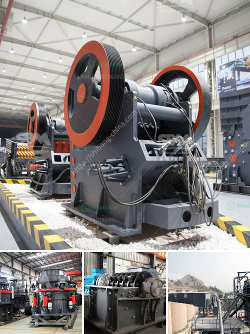

<h3>trapezium mill south africa</h3>
In South Africa's industrial sector, the demand for superior milling machines has never been higher. Manufacturing companies across the nation are constantly seeking cutting-edge solutions that can enhance production efficiency and reduce costs. One such game-changer that has revolutionized the milling industry is the trapezium mill.

The trapezium mill, also known as the MTW European version of the mill, is a highly efficient industrial milling machine, widely recognized for its low energy consumption, high output, and excellent performance. With its unique curved blade design and innovative working principle, the trapezium mill offers a groundbreaking solution for grinding and processing various materials.

One of the most significant advantages of the trapezium mill is its adaptability to process multiple materials, including limestone, quartz, calcite, granite, porcelain clay, and more. This versatility has made it a perfect choice for South African manufacturing companies operating in diverse sectors such as mining, metallurgy, construction, and chemical engineering.

Furthermore, the trapezium mill ensures precise control over the size and shape of the final product. Its efficient grinding mechanism guarantees that materials are ground into fine particles, enabling companies to produce top-quality outputs that meet strict industry standards. This level of precision is crucial for industries that rely on specific particle sizes, such as cement manufacturing or mineral processing.

Another noteworthy feature of the trapezium mill is its advanced technology for dust removal and noise reduction. South Africa has been actively working towards more sustainable and environmentally-friendly practices, making this trait highly desirable for local manufacturers. By incorporating cutting-edge dust removal and noise reduction systems, the trapezium mill minimizes pollution and creates a safer working environment for operators.

The trapezium mill has quickly become a go-to milling machine for South African manufacturers seeking innovative solutions. Its superior performance, adaptability, and eco-friendliness have set new standards in the milling industry. As the demand for high-quality products continues to rise, the trapezium mill will undoubtedly play a crucial role in South Africa's journey towards industrial excellence.
<h3>Contact us</h3><ul><li><strong>Whatsapp:&nbsp;<a href="https://wa.me/8613661969651">+8613661969651</a></strong></li><li><a href="https://swt.shibang-china.com/?git&amp;zhl&amp;trapezium mill south africa"><strong>Online Service(chat now)</strong></a></li></ul><h3>Related</h3><ul><li><a href='coal crusher manufacturer.md'>coal crusher manufacturer</a></li><li><a href='aluminum slag processing plant in germany.md'>aluminum slag processing plant in germany</a></li><li><a href='construction of a clinker plant.md'>construction of a clinker plant</a></li><li><a href='rock crushing plant mobile.md'>rock crushing plant mobile</a></li><li><a href='grinding garnet machine.md'>grinding garnet machine</a></li></ul>