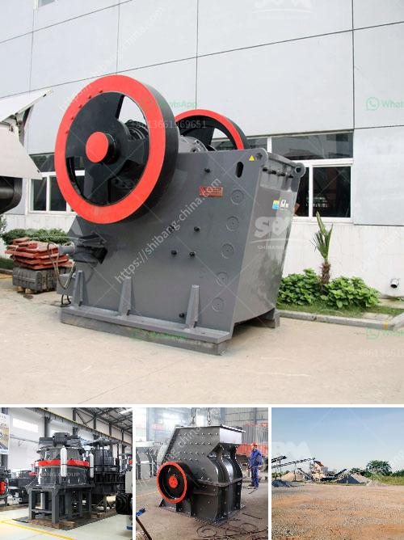

<h3>turkey quarry machines manufacturer</h3>
Turkey has long been renowned for its marble and other natural stone reserves, making it a global hub for the quarrying industry. To meet the growing demand for stone products, Turkey has continuously invested in cutting-edge machinery and technology, establishing itself as a leading manufacturer of quarry machines. With a focus on innovation and quality, Turkish manufacturers have been able to cater to the needs of both domestic and international markets.

One of the key players in the Turkish quarry machines manufacturing sector is [Company Name], a company that has been operating since [Year]. With a strong commitment to research and development, [Company Name] has consistently introduced state-of-the-art machinery to the market, revolutionizing the quarrying process. Their machines are not only efficient and productive but also environmentally friendly, reducing the impact on natural resources.

Innovation is at the core of [Company Name]'s success. They have invested heavily in research and development, working closely with engineers and experts to develop cutting-edge technologies that improve efficiency and productivity. By incorporating automation and advanced control systems, [Company Name] machines can operate with precision, minimizing wastage and maximizing output. This not only benefits the quarry operators but also ensures the sustainable use of natural resources.

Quality is another aspect that sets Turkish quarry machines manufacturers apart. [Company Name] understands the importance of delivering reliable and robust machines that can withstand the demanding quarrying conditions. They source the highest quality materials and components, ensuring that their machines are built to last. Additionally, [Company Name] provides comprehensive after-sales support, offering maintenance services and spare parts to ensure their customers' machines are always running at peak performance.

Exporting to over [Number] countries worldwide, Turkish quarry machines manufacturers have earned a reputation for their craftsmanship and reliability. The machines manufactured in Turkey are known for their durability, efficiency, and ability to withstand the toughest working conditions. This has resulted in a loyal customer base that continues to choose Turkish manufacturers over their competitors.

Furthermore, Turkish quarry machines manufacturers are committed to sustainable practices. They understand the importance of minimizing the environmental impact of quarrying activities and have implemented various measures to achieve this. From using energy-efficient technologies to adopting water recycling systems, Turkish manufacturers are leading the way in responsible quarrying practices.

In conclusion, Turkey has emerged as a global leader in quarry machines manufacturing, providing innovative and high-quality machinery to the industry. Turkish manufacturers like [Company Name] have revolutionized the quarrying process, introducing cutting-edge technologies that improve efficiency and reduce environmental impact. With a focus on innovation, quality, and sustainability, Turkish quarry machines manufacturers continue to meet the demands of the domestic and international markets, positioning Turkey as a powerhouse in the industry.
<h3>Contact us</h3><ul><li><strong>Whatsapp:&nbsp;<a href="https://wa.me/8613661969651">+8613661969651</a></strong></li><li><a href="https://swt.shibang-china.com/?git&amp;zhl&amp;turkey quarry machines manufacturer"><strong>Online Service(chat now)</strong></a></li></ul><h3>Related</h3><ul><li><a href='cost setting up silica sand ball mill.md'>cost setting up silica sand ball mill</a></li><li><a href='stone crushing plant keesara.md'>stone crushing plant keesara</a></li><li><a href='crushing plant for aggregate india.md'>crushing plant for aggregate india</a></li><li><a href='crusher plant in construction.md'>crusher plant in construction</a></li><li><a href='calcium carbonate process flow diagram.md'>calcium carbonate process flow diagram</a></li></ul>