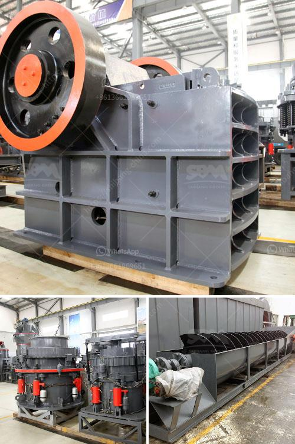

<h3>types of ball mills</h3>
Ball mills are cylindrical grinding machines commonly used in the mining, metallurgical, construction, chemical, and other industries. These versatile machines are known for their low maintenance ratio and high reliability. They enable better control and optimization of the milling process, which results in enhanced efficiency and productivity. In this article, we will discuss several types of ball mills and their respective applications.

These are the most common type. The basic design consists of a horizontal cylindrical drum, partially filled with grinding media (e.g., steel balls) that rotate around its axis. The material to be ground is fed into the chamber through a hollow shaft, which contains a screw conveyor for continuous discharge. Horizontal ball mills are ideal for fine grinding, especially when it comes to cement and mining industries.

As the name suggests, these ball mills are vertical in orientation and include a vertical cylindrical drum. Vertical ball mills often come with a variety of ball sizes (and have variable speed settings) for more efficient processing. Industrial versions are made of metal and have ceramic linings. Their special design allows for a higher degree of stability and precise milling when compared to horizontal ball mills.

Planetary ball mills are smaller in size and have finer grinding capabilities compared to the aforementioned types. These machines are used for mixing, homogenizing, and mechanical alloying of materials. Planetary ball mills consist of several grinding jars arranged eccentrically on a sun wheel. The rotation of the wheel causes the jars to simultaneously revolve around their own axis. This results in a more efficient grinding process.

Also known as ball pebble mills, these mills are essential in many industries due to their ability to crush and grind materials into fine powders. Pebble ball mills are similar to ball mills, except they are partially filled with pebbles instead of grinding media (steel balls). Pebble mills are widely used in the ceramics and glass industries.

Vibrating ball mills are ideal for low-capacity applications. These mills utilize vibration for rapid and efficient grinding. The grinding chamber is placed in oscillatory motion, which facilitates rapid particle size reduction. Vibrating ball mills are commonly used for pharmaceutical and chemical applications.

In conclusion, ball mills are essential tools in the material processing industry. Depending on the specific application, different types of ball mills can be used to effectively grind and homogenize materials. Horizontal and vertical ball mills are widely used for fine grinding, while planetary and pebble ball mills are widely used for mixing and mechanical alloying, respectively. Vibrating ball mills are suitable for low-capacity applications. With their versatility and efficiency, ball mills are critical equipment for many industries, ensuring high-quality products are produced consistently.
<h3>Contact us</h3><ul><li><strong>Whatsapp:&nbsp;<a href="https://wa.me/8613661969651">+8613661969651</a></strong></li><li><a href="https://swt.shibang-china.com/?git&amp;zhl&amp;types of ball mills"><strong>Online Service(chat now)</strong></a></li></ul><h3>Related</h3><ul><li><a href='the process of limestone.md'>the process of limestone</a></li><li><a href='portable gold ore crusher.md'>portable gold ore crusher</a></li><li><a href='tanzania gold crusher price.md'>tanzania gold crusher price</a></li><li><a href='working cone crushers.md'>working cone crushers</a></li><li><a href='components of a limestone primary plant.md'>components of a limestone primary plant</a></li></ul>