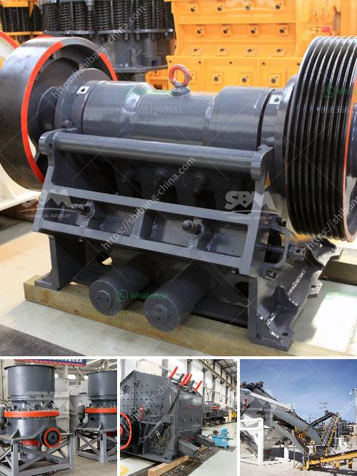

<h3>types of conveyor belts</h3>
Conveyor belts are an integral part of modern industrial processes. They are essential for the efficient transportation of materials and products in industries such as mining, manufacturing, food processing, and logistics. There are various types of conveyor belts available, each designed for specific applications. In this article, we will explore some of the most common types of conveyor belts.

1. Flat Belt Conveyors: This is the simplest and most commonly used type of conveyor belt. The flat belt runs on the pulleys and is capable of carrying various materials, including lightweight to medium-weight products. Flat belt conveyors are ideal for horizontal or slightly inclined conveying.

2. Modular Belt Conveyors: These belts consist of individual plastic modules that are interlocked to form a continuous conveying surface. They are highly versatile and can handle heavy loads and withstand harsh environments. Modular belt conveyors are commonly used in application areas where there is a need for accumulation of products or where the belt needs to change direction.

3. Cleated Belt Conveyors: Cleated belts have raised ridges, or cleats, on their surface, which prevent the material from sliding and falling off the conveyor. They are used for transporting bulk materials at steep angles or on inclines. Cleated belt conveyors are commonly used in industries such as mining, agriculture, and construction.

4. Roller Bed Conveyors: These conveyors have rollers mounted along the length of the conveyor bed. As the belt moves, the material is carried along by the rotating rollers. Roller bed conveyors are ideal for transporting heavy materials over long distances. They are often used in warehouses, shipping areas, and assembly lines.

5. Incline Belt Conveyors: These conveyors are designed to transport products or materials up or down an incline. They are commonly used for loading and unloading trucks or moving products between different levels of a facility. Incline belt conveyors have specially designed cleats or flights to ensure that the material remains secure while ascending or descending.

6. Troughed Belt Conveyors: The belt of these conveyors is shaped into a 'U' or 'V' shape to minimize spillage and ensure efficient material handling. Troughed belt conveyors are used to transport bulk materials such as coal, sand, ore, grain, and even hot or oily materials. They are commonly used in industries such as mining, quarrying, and power generation.

7. Magnetic Belt Conveyors: These conveyors use magnets to hold and guide ferrous materials along the belt during transportation. They are commonly used in industries where material handling requires precise control, such as in the food and pharmaceutical industries.

In conclusion, conveyor belts play a crucial role in various industries and are available in a range of types to suit specific requirements. Whether it is flat belt conveyors for horizontal transportation or cleated belt conveyors for inclined conveying, choosing the right type of conveyor belt is essential to ensure efficient and safe material handling.
<h3>Contact us</h3><ul><li><strong>Whatsapp:&nbsp;<a href="https://wa.me/8613661969651">+8613661969651</a></strong></li><li><a href="https://swt.shibang-china.com/?git&amp;zhl&amp;types of conveyor belts"><strong>Online Service(chat now)</strong></a></li></ul><h3>Related</h3><ul><li><a href='nigeria crusher industries.md'>nigeria crusher industries</a></li><li><a href='calcium carbonate for ball mill.md'>calcium carbonate for ball mill</a></li><li><a href='ball grinding machine in india.md'>ball grinding machine in india</a></li><li><a href='powder mill grinding machine in nigeria.md'>powder mill grinding machine in nigeria</a></li><li><a href='big crusher stones east london south africa.md'>big crusher stones east london south africa</a></li></ul>