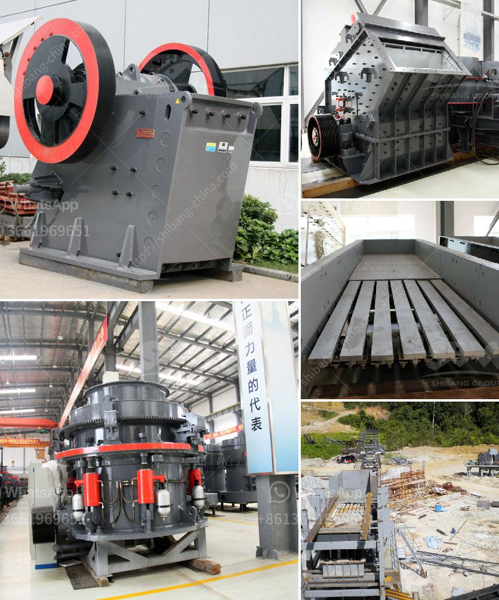

<h3>types of crushing machine</h3>
Crushing machines are used in a variety of sectors to break down a range of materials into smaller, more manageable pieces. These machines come in different shapes and sizes, but they all perform the same essential function: crushing materials into smaller, more uniform particles.

One commonly recognized type is the jaw crusher. This machine uses compression to crush the material between moving and stationary jaws. The material is fed into the space between the jaws, which then apply force to break it down into smaller pieces. Jaw crushers are commonly used in the mining and construction industries due to their versatility and high efficiency.

Another type of crushing machine is the cone crusher. It operates on the same principle as a gyratory crusher but has a steep cone angle and a concave surface. As the material enters the cone crusher, it is squeezed between the mantle and concave, which produces finer, uniform particles. Cone crushers are often used in the aggregate, mining, and quarrying industries.

Impact crushers, as the name suggests, use impact to crush the material. They utilize collision forces generated by rotating rotors or hammers to break down the material into smaller pieces. Impact crushers are widely used in recycling applications and the reduction of soft to medium-hard materials.

Roll crushers are yet another type of crushing machine that uses compression and shear forces between two rotating rolls to break down the material. They are ideal for reducing large rock or ore pieces into smaller, more manageable sizes.

Lastly, there are several specialized crushing machines used in specific industries. For example, a cage mill is commonly used in the coal industry to crush materials such as coal, limestone, and gypsum. In the agricultural industry, hammer mills are used to pulverize grains and other agricultural products.

In conclusion, various types of crushing machines are used to break down materials into smaller, more manageable sizes. These machines cater to different industries and applications, ensuring that materials can be effectively processed and utilized. Whether it is in mining, construction, recycling, or agricultural sectors, crushing machines play a crucial role in material preparation.
<h3>Contact us</h3><ul><li><strong>Whatsapp:&nbsp;<a href="https://wa.me/8613661969651">+8613661969651</a></strong></li><li><a href="https://swt.shibang-china.com/?git&amp;zhl&amp;types of crushing machine"><strong>Online Service(chat now)</strong></a></li></ul><h3>Related</h3><ul><li><a href='prices of stone crushers.md'>prices of stone crushers</a></li><li><a href='nigeria raymond mill.md'>nigeria raymond mill</a></li><li><a href='schredder and grinding mille for sale.md'>schredder and grinding mille for sale</a></li><li><a href='grinding mill for limestone italy.md'>grinding mill for limestone italy</a></li><li><a href='quartz plant in india.md'>quartz plant in india</a></li></ul>