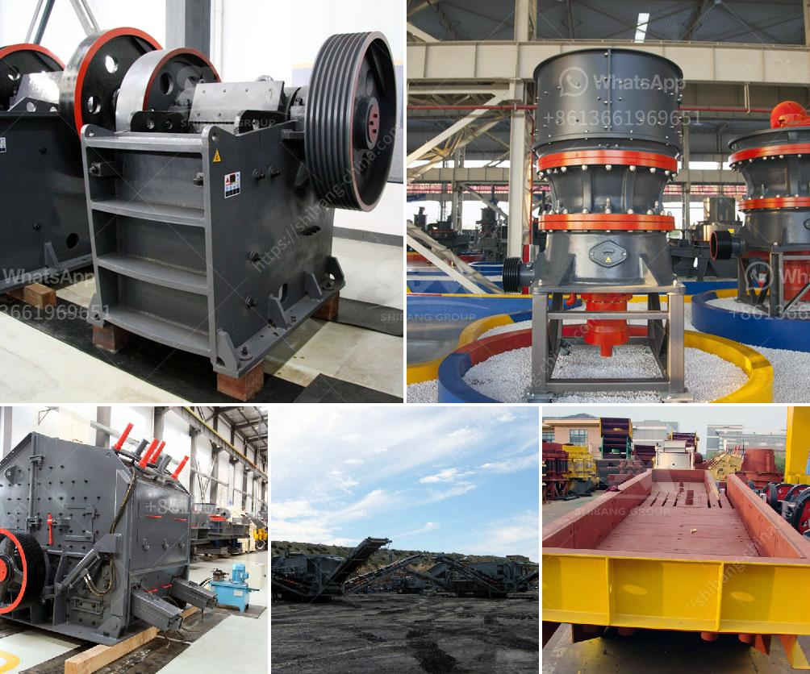

<h3>types of jaw crusher</h3>
A jaw crusher is an essential machine in the mining and construction industry. It is primarily used as a primary crusher to reduce large chunks of rocks into smaller particles for further processing. There are several types of jaw crushers available to choose from, each with its own unique features and benefits.

The first type is the traditional jaw crusher, which is also known as the Blake crusher. This type of jaw crusher has a fixed jaw and a moving jaw pivoted at the top. The rocks fed into the crusher are squeezed between the two jaws and crushed as they move towards the bottom of the crushing chamber. This type of crusher is ideal for hard, abrasive materials such as granite or basalt.

Another type of jaw crusher is the dodge crusher. Similar to the Blake crusher, this type of crusher utilizes a swinging jaw. However, it differs in that the swing jaw is pivoted at the bottom, providing a variable feed area and a fixed discharge area. This design allows for a higher throughput and reduction ratio compared to the Blake crusher.

The third type is the gyratory crusher. Unlike the previous two crushers, this crusher has a conical head and reveals a stationary concave surface. This design provides a larger feed opening and a smoother operation, making it suitable for crushing large-sized materials and obtaining a consistent particle size.

Lastly, the universal crusher is a hybrid of the previous three types. It combines the advantages of the traditional jaw, dodge, and gyratory crushers. This versatile crusher can handle all types of materials, from soft to hard and from dry to wet. It offers a higher reduction ratio and a uniform particle size.

In conclusion, a jaw crusher is a versatile machine that plays a crucial role in the mining and construction industry. The different types of jaw crushers available allow customers to choose a crusher that best suits their specific needs and requirements. Whether it is for primary crushing or secondary crushing, a jaw crusher is an important investment that should be carefully considered.
<h3>Contact us</h3><ul><li><strong>Whatsapp:&nbsp;<a href="https://wa.me/8613661969651">+8613661969651</a></strong></li><li><a href="https://swt.shibang-china.com/?git&amp;zhl&amp;types of jaw crusher"><strong>Online Service(chat now)</strong></a></li></ul><h3>Related</h3><ul><li><a href='price of quarry crusher in zambia.md'>price of quarry crusher in zambia</a></li><li><a href='quartz stone plant in china.md'>quartz stone plant in china</a></li><li><a href='prices crusher prices gypsum crusher prices.md'>prices crusher prices gypsum crusher prices</a></li><li><a href='china wet ball mill.md'>china wet ball mill</a></li><li><a href='bauxite crusher plant construction.md'>bauxite crusher plant construction</a></li></ul>