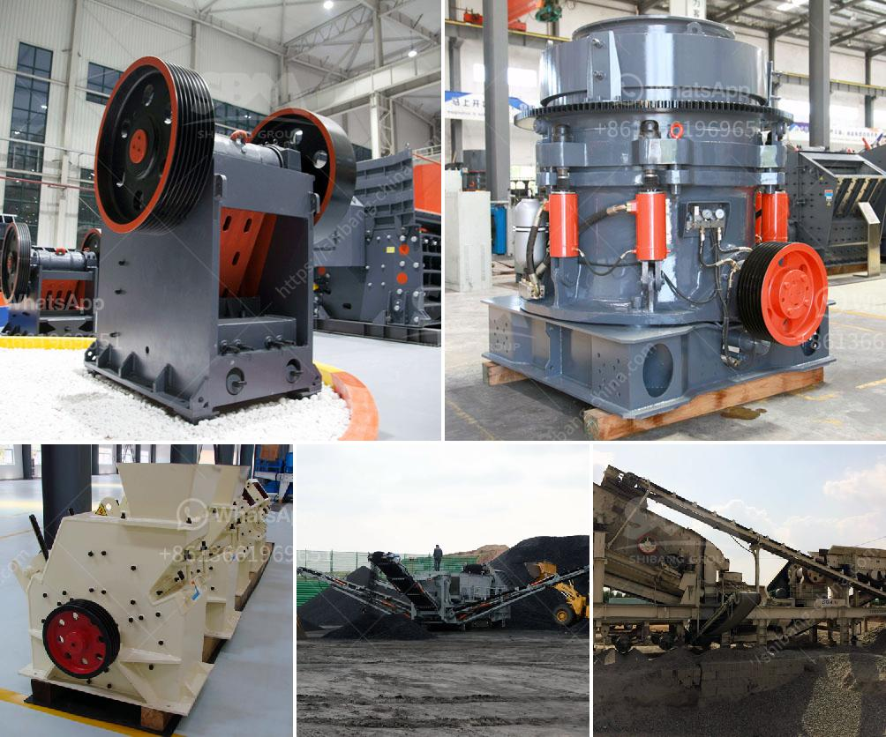

<h3>ulltra fine grinding mill</h3>
Grinding mills have been used for decades to improve the efficiency of particle size reduction in different industries. While conventional mills have been the benchmark for many years, continuous developments have led to ultra fine grinding mills with outstanding performance.

Ultra fine grinding mills have been in use for many years in a large number of every day applications such as pharmaceuticals, dyes, clays, paint and pigments before being used in the mineral processing industry to produce fine and ultra fine powders, as well as nanomaterials.

The development of ultra fine grinding mills has led to increasing demand for smaller, more efficient mills. However, there is a limit on the size of mills available in the market. Most mills used in ultra fine grinding have cylindrical chambers in which rotating a shaft with agitated media causes intense particle-particle interactions.

The ultra fine grinding mill is therefore able to achieve a much more efficient level of grinding with lower energy consumption. Ultra fine grinding mills are also commonly referred to as stirred media mills, making them excellent tools for mining and mineral processing operations.

One example of an ultra fine grinding mill is the vertical stirred mill, also known as the VXPmill. It utilizes a vertical arrangement to grind materials instead of horizontal grinding jars or cylinders. This allows for smaller media to be used in the mill, commonly ranging from 1.5mm to 3mm, leading to significantly higher grinding efficiency compared to conventional ball mills.

The VXPmill can produce fine and ultra fine particles, achieving top sizes of less than 10 microns and typical D50 values down to 1-2 microns. It is well-suited for applications requiring high grinding efficiency and fine particle size control, such as in the production of filler materials, coatings, and pigments.

One of the main advantages of ultra fine grinding mills is their ability to produce narrow particle size distributions. This is accomplished through the use of specialized grinding media, such as ceramic beads or steel balls, which are selected based on the desired particle size range. The controlled size reduction not only leads to improved product quality, but also reduces over-grinding, resulting in significant energy savings.

In addition to their efficient particle size reduction capabilities, ultra fine grinding mills offer several other benefits. They are compact in size, requiring less floor space than traditional ball mills. They also offer flexibility in terms of grinding media type and size, allowing for customization based on the specific requirements of each application.

Ultra fine grinding mills have revolutionized the way materials are ground and processed. With their ability to achieve fine and ultra fine particle sizes, higher grinding efficiency, and energy savings, they have become an essential tool for various industries.

In conclusion, the ultra fine grinding mill is an innovative and efficient solution for fine and ultra fine particle size reduction. It offers several advantages over conventional mills, including higher grinding efficiency, narrow particle size distributions, and energy savings. With their versatility and customization options, ultra fine grinding mills are well-suited for a wide range of applications across different industries.
<h3>Contact us</h3><ul><li><strong>Whatsapp:&nbsp;<a href="https://wa.me/8613661969651">+8613661969651</a></strong></li><li><a href="https://swt.shibang-china.com/?git&amp;zhl&amp;ulltra fine grinding mill"><strong>Online Service(chat now)</strong></a></li></ul><h3>Related</h3><ul><li><a href='crusher plants for sale in pakistan.md'>crusher plants for sale in pakistan</a></li><li><a href='sayaji jaw crusher price list.md'>sayaji jaw crusher price list</a></li><li><a href='barium sulfate production line manufacturer.md'>barium sulfate production line manufacturer</a></li><li><a href='hammer grinding machine philippines.md'>hammer grinding machine philippines</a></li><li><a href='silica sand concrete in ethiopia.md'>silica sand concrete in ethiopia</a></li></ul>