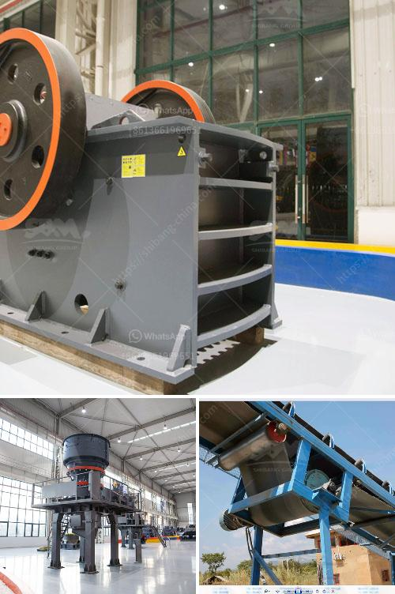

<h3>ultra fine dry grinding mill</h3>
In the world of mining and milling, there are many technological advancements that have taken place in recent years. One such advancement is the ultra fine dry grinding mill. This technology allows for the grinding of extremely small particles that traditional grinding mills are not capable of achieving.

The ultra fine dry grinding mill is proven to be the game changer in ore processing, as it can grind the ore down to as low as 10 microns. This makes it the ideal choice for large scale ore processing with a low environmental impact. The ultra fine dry grinding mill also allows for the production of powders with a narrow particle size distribution, resulting in higher product quality and consistency.

One key advantage of the ultra fine dry grinding mill is its efficiency. Compared to traditional wet grinding mills, this technology consumes significantly less energy, resulting in lower operational costs. Additionally, the ultra fine dry grinding mill has a smaller footprint, making it easier to integrate into existing ore processing plants.

Another benefit of the ultra fine dry grinding mill is its versatility. It can be used to grind a wide variety of materials, including ores, minerals, chemicals, and even certain food products. This makes it a valuable tool for industries beyond mining, such as pharmaceuticals and cosmetics.

The ultra fine dry grinding mill is also known for its durability and reliability. It is designed to withstand harsh operating conditions and has a long service life. Maintenance requirements are minimal, saving both time and money for operators.

Overall, the ultra fine dry grinding mill is revolutionizing the world of ore processing. Its ability to produce ultra-fine particles at low energy consumption and with high efficiency makes it a game changer for the industry. As more mining and milling companies adopt this technology, we can expect to see improved product quality, reduced environmental impact, and increased profitability.
<h3>Contact us</h3><ul><li><strong>Whatsapp:&nbsp;<a href="https://wa.me/8613661969651">+8613661969651</a></strong></li><li><a href="https://swt.shibang-china.com/?git&amp;zhl&amp;ultra fine dry grinding mill"><strong>Online Service(chat now)</strong></a></li></ul><h3>Related</h3><ul><li><a href='crusher cost stone crusher peru cost.md'>crusher cost stone crusher peru cost</a></li><li><a href='copper ore conveying system.md'>copper ore conveying system</a></li><li><a href='the process of limestone.md'>the process of limestone</a></li><li><a href='jaw crusher principle in the refractory.md'>jaw crusher principle in the refractory</a></li><li><a href='used cement plant for sale in south africa.md'>used cement plant for sale in south africa</a></li></ul>