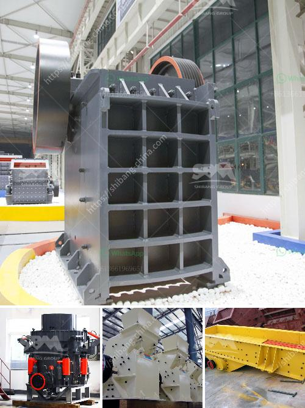

<h3>ultra fine grinding equipment</h3>
Ultra-fine grinding equipment is a crucial step in chemical and material processing industries. It is a technology that combines mechanical and chemical properties to achieve unprecedented levels of solid material fineness. This is accomplished by reducing particle size below 20 microns through various grinding mechanisms. Ultra-fine grinding opens up new possibilities for enhancing product quality, improving material properties, and enabling the production of advanced materials.

One of the primary benefits of ultra-fine grinding is the ability to increase surface area. By reducing particle size, the overall surface area exposed to the surrounding environment significantly increases. This enhanced surface area allows for improved chemical reactions, such as dissolution, absorption, and catalysis. It is particularly useful in applications where increased reactivity is desired, such as in the production of pharmaceuticals, pigments, and catalysts.

Ultra-fine grinding equipment utilizes different grinding mechanisms to achieve the desired particle size reduction. The most common methods include impact, compression, and attrition. Impact grinding involves high-speed rotating equipment that imparts kinetic energy to the particles, causing them to collide with surfaces and break apart. Compression grinding, on the other hand, applies pressure to crush particles between two surfaces. Attrition grinding involves the rubbing and shearing of particles against each other or against a stationary surface, resulting in size reduction.

There are several types of ultra-fine grinding equipment available in the market, each with its own unique features and capabilities. Jet mills, for example, use high-speed jets of fluid to impact particles, resulting in size reduction. These mills are known for their ability to produce ultra-fine powders with narrow particle size distributions. Ball mills, on the other hand, use balls of varying sizes to grind materials, relying on impact and attrition to achieve particle size reduction. They are widely used in the mining and mineral processing industry.

Another type of ultra-fine grinding equipment is the vibratory mill. Vibratory mills use oscillating motions to impact particles against grinding media, resulting in rapid size reduction. These mills are particularly suitable for grinding brittle materials and have been used in the production of advanced ceramics and powder metallurgy.

The choice of ultra-fine grinding equipment depends on various factors, including the desired particle size, the properties of the feed material, and the required production capacity. It is crucial to select the appropriate equipment to ensure optimal grinding performance and product quality.

In conclusion, ultra-fine grinding equipment plays a critical role in various industries, enabling the production of high-quality products with enhanced material properties. Its ability to increase surface area and improve reactivity makes it highly valuable for applications ranging from pharmaceuticals to advanced ceramics. By selecting the right equipment and utilizing appropriate grinding mechanisms, manufacturers can fully harness the potential of ultra-fine grinding and unlock new possibilities in their respective fields.
<h3>Contact us</h3><ul><li><strong>Whatsapp:&nbsp;<a href="https://wa.me/8613661969651">+8613661969651</a></strong></li><li><a href="https://swt.shibang-china.com/?git&amp;zhl&amp;ultra fine grinding equipment"><strong>Online Service(chat now)</strong></a></li></ul><h3>Related</h3><ul><li><a href='stone crushers suppliers in south africa.md'>stone crushers suppliers in south africa</a></li><li><a href='difference between pulveriser and.md'>difference between pulveriser and</a></li><li><a href='stone crusher machine company.md'>stone crusher machine company</a></li><li><a href='copper ore crushing machinery.md'>copper ore crushing machinery</a></li><li><a href='feldspar powder machine.md'>feldspar powder machine</a></li></ul>