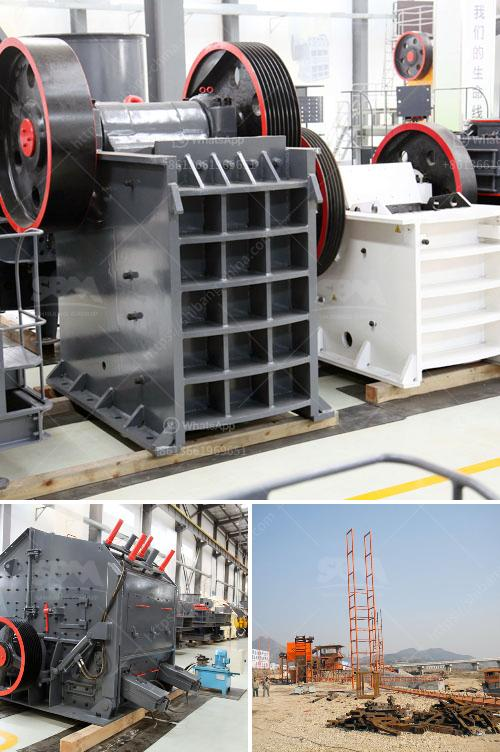

<h3>ultra fine milling machines</h3>
Ultra fine milling machines have revolutionized the manufacturing industry with their incredible precision and efficiency. These machines are capable of producing exceptionally fine powder or particle sizes, making them ideal for a wide range of applications, including pharmaceuticals, chemicals, and advanced materials.

One of the key features of ultra fine milling machines is their ability to control the particle size distribution with great accuracy. The machines use advanced technologies, such as air classification and turbulence milling, to achieve the desired particle size range. The result is a uniform and consistent powder, which is essential for achieving high-quality end products.

Another advantage of ultra fine milling machines is their high productivity. These machines can process large quantities of materials in a short period, significantly reducing production time and costs. Additionally, the advanced automation systems integrated into these machines allow for easy operation and minimization of human error, further enhancing productivity.

In terms of product quality, ultra fine milling machines offer unparalleled precision. The machines can achieve particle sizes as small as a few micrometers or even a few nanometers, depending on the specific milling technique employed. This level of precision ensures that the final product meets the strictest quality standards.

Furthermore, ultra fine milling machines are highly versatile. They can process a wide variety of materials, ranging from soft and ductile materials to hard and brittle ones. Whether it's grinding, pulverizing, or micronizing, these machines offer the flexibility to handle different materials and produce the desired particle size distribution.

Overall, ultra fine milling machines have transformed the manufacturing industry by providing precision, efficiency, and versatility. These machines have enabled manufacturers to produce high-quality products with minimal waste and increased productivity. As technology continues to advance, we can expect even more developments in the field of ultra fine milling machines, further pushing the boundaries of what is possible in manufacturing.
<h3>Contact us</h3><ul><li><strong>Whatsapp:&nbsp;<a href="https://wa.me/8613661969651">+8613661969651</a></strong></li><li><a href="https://swt.shibang-china.com/?git&amp;zhl&amp;ultra fine milling machines"><strong>Online Service(chat now)</strong></a></li></ul><h3>Related</h3><ul><li><a href='mobile concrete crusher trailer mounted.md'>mobile concrete crusher trailer mounted</a></li><li><a href='gravel crushing machine in ethiopia.md'>gravel crushing machine in ethiopia</a></li><li><a href='picture of complete of quarry crushing plant nigeria.md'>picture of complete of quarry crushing plant nigeria</a></li><li><a href='lime making machine.md'>lime making machine</a></li><li><a href='crusher machine for sale in ethiopia.md'>crusher machine for sale in ethiopia</a></li></ul>