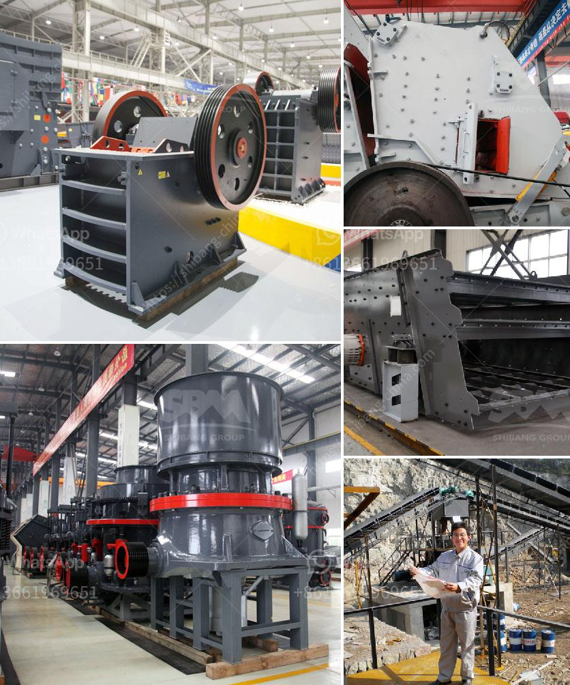

<h3>used cement crushers for sale</h3>
When it comes to construction projects, cement crushers are an essential piece of equipment for breaking down larger chunks of concrete into more manageable sizes. These crushers are indispensable for demolishing old structures and recycling concrete waste, making them an environmentally friendly and cost-effective solution.

The market for used cement crushers has witnessed a significant surge in recent years, mainly due to their ability to reduce costs and enhance productivity on construction sites. As construction projects become more intricate and time-sensitive, having access to efficient and reliable crushers is becoming increasingly crucial.

One of the key advantages of investing in used cement crushers is the potential for substantial cost savings. New equipment can often be expensive, making it difficult for smaller construction companies to afford the latest models. However, the market for used crushers offers a more budget-friendly alternative without compromising on quality.

By purchasing used crushers, companies can achieve a more immediate return on investment. They can acquire high-quality equipment at a fraction of the cost, allowing them to allocate their resources in other areas of their projects. Additionally, used crushers are generally in good working condition, making them a reliable choice for contractors seeking durable machinery.

Used cement crushers also contribute to environmental sustainability. Construction waste is a significant issue, with concrete waste being one of the largest contributors. By recycling and reusing concrete through crushers, the amount of waste sent to landfills can be significantly reduced. This not only saves valuable landfill space but also helps to conserve natural resources by reducing the demand for new concrete production.

Another benefit of used cement crushers is their versatility. They come in various sizes and types, including jaw crushers, impact crushers, and cone crushers. This wide range allows contractors to select the most suitable crusher for their specific needs, ensuring optimal performance on their projects. Whether it's demolishing old buildings or breaking down concrete slabs, there is a used cement crusher available for every task.

The availability of used cement crushers is also a time-saving advantage. Purchasing new equipment often involves long lead times, from the order to the delivery and setup. However, with used crushers, the time between purchase and deployment on-site is significantly reduced. This enables construction companies to commence their projects promptly, preventing delays and maximizing overall productivity.

In conclusion, investing in used cement crushers is a wise decision for construction companies looking to save costs, enhance productivity, and contribute to environmental sustainability. By purchasing high-quality, pre-owned crushers, contractors can achieve immediate cost savings and quickly put the equipment to work on their construction sites. With their ability to recycle concrete waste and reduce reliance on new concrete production, used cement crushers are an effective solution for modern construction projects.
<h3>Contact us</h3><ul><li><strong>Whatsapp:&nbsp;<a href="https://wa.me/8613661969651">+8613661969651</a></strong></li><li><a href="https://swt.shibang-china.com/?git&amp;zhl&amp;used cement crushers for sale"><strong>Online Service(chat now)</strong></a></li></ul><h3>Related</h3><ul><li><a href='supplier of conveyor belt kenya.md'>supplier of conveyor belt kenya</a></li><li><a href='gravel crushing machine in ethiopia.md'>gravel crushing machine in ethiopia</a></li><li><a href='clinker making machine for sell germany.md'>clinker making machine for sell germany</a></li><li><a href='bentonite granuels machines gujrat.md'>bentonite granuels machines gujrat</a></li><li><a href='business plan for small mining processing plant.md'>business plan for small mining processing plant</a></li></ul>