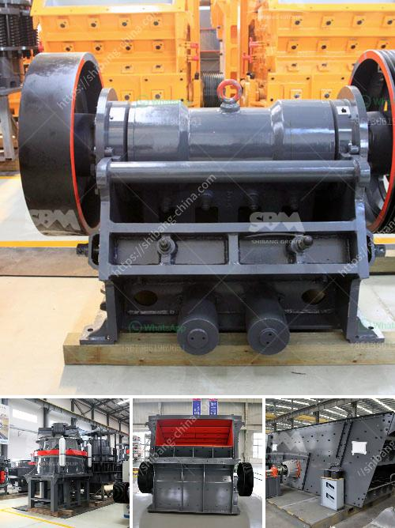

<h3>used cement mills for sale in india</h3>
India is one of the fastest-growing economies in the world. With rapid infrastructural development taking place, the country is in constant need of construction materials such as cement. As a result, the demand for cement mills, which help grind and convert raw materials into desired powder form used in the production of cement, has been on the rise.

However, procuring new cement mills can be an expensive and time-consuming process, especially for small and medium-sized enterprises (SMEs). To overcome this challenge, many businesses in India now prefer buying used cement mills to meet their production requirements. This not only saves them significant costs but also provides them with access to equipment that is still in good working condition.

The cement industry in India has come a long way. Today, there are numerous cement manufacturers operating across the country, each with its own unique requirements when it comes to cement mills. While some may need specific types of mills to cater to the finer grinding needs, others may require mills that can handle larger volumes of raw materials.

Thanks to the increasing number of cement plants being set up in different parts of India, the availability of used cement mills for sale has improved significantly. These mills are often sold by larger companies after they upgrade their production processes or move to more advanced machinery. As a result, buyers can find various types and sizes of used cement mills to match their specific needs.

By opting for used cement mills for sale, businesses can save on upfront costs, which often make up a substantial part of the investment required for setting up a plant. Additionally, buying used equipment ensures faster delivery, as the mills are readily available and can be installed faster compared to new ones that may have longer lead times.

Apart from cost and availability, another advantage of buying used cement mills is the potential for customization. Many used mills can be retrofitted or modified to suit the specific requirements of the buyer, allowing them to fine-tune the performance of the equipment. This not only provides a cost-effective solution but also ensures that businesses can maximize their operational efficiency.

While buying used cement mills can be a viable option, it is crucial for buyers to assess the condition of the equipment before making a purchase. This involves inspecting the mills for any signs of wear and tear, checking the motor and other critical components, and ensuring that they have been maintained properly. Consulting with experts or hiring a third-party inspection service can help buyers make an informed decision and avoid potential costly repairs or replacements in the future.

In summary, the availability of used cement mills for sale in India offers a cost-effective and efficient solution for businesses in the cement industry. While new mills may be out of reach for many SMEs, buying used cement mills enables them to access reliable equipment at a fraction of the cost. However, due diligence is necessary to ensure that the mills are in good working condition and meet the specific requirements of the buyer.
<h3>Contact us</h3><ul><li><strong>Whatsapp:&nbsp;<a href="https://wa.me/8613661969651">+8613661969651</a></strong></li><li><a href="https://swt.shibang-china.com/?git&amp;zhl&amp;used cement mills for sale in india"><strong>Online Service(chat now)</strong></a></li></ul><h3>Related</h3><ul><li><a href='stone grinding roller mill for sale.md'>stone grinding roller mill for sale</a></li><li><a href='list mining equipments are used in granite quarries.md'>list mining equipments are used in granite quarries</a></li><li><a href='new stamp mill for sale in zimbabwe.md'>new stamp mill for sale in zimbabwe</a></li><li><a href='rock pulverizer crusher technologies.md'>rock pulverizer crusher technologies</a></li><li><a href='diamond mining jaw crusher.md'>diamond mining jaw crusher</a></li></ul>