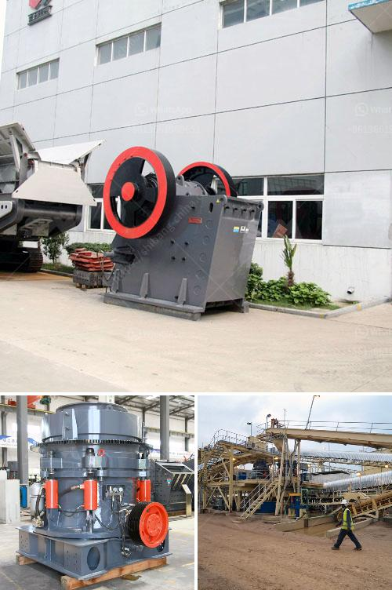

<h3>used cement plant for sale in south africa</h3>
If you are in the market for a used cement plant for sale in South Africa, you are in luck! With the staggering growth of infrastructure development and urbanization in the country, there is a huge demand for cement. With this rising demand, many construction companies and individuals are looking for cost-effective options, such as buying a used cement plant.

There are several advantages to purchasing a used cement plant. Firstly, it is a more budget-friendly option compared to buying a brand-new plant. A used plant can cost significantly less than a new one, allowing you to save on capital investment. Additionally, buying a used plant means that you can get your operations up and running more quickly since there is no need for extensive construction and installation processes.

Another advantage of buying a used cement plant is that you can analyze its performance and track record. This allows you to make an informed decision based on the plant's history and efficiency. You can assess its reliability, energy consumption, and output capacity to ensure that it meets your requirements. Additionally, if the plant has been well-maintained by the previous owner, it can provide you with years of steady production.

When looking for a used cement plant for sale in South Africa, there are several factors to consider. Firstly, you need to determine the capacity of the plant. This is crucial as it will dictate the amount of cement you can produce. Take into account your current and future demand to ensure that the plant meets your production needs. It is also important to check the condition of the plant's machineries and equipment. Look for signs of wear and tear, corrosion, or malfunctioning components. Taking the time to inspect the plant thoroughly can help you avoid costly repairs and replacements in the future.

In addition to assessing the condition of the plant, you should also consider the reputation and credibility of the seller. Research the company selling the used cement plant and read reviews or feedback from previous customers. It is essential to work with a reputable and trustworthy seller to ensure that you are getting a reliable plant.

It is also recommended to seek professional advice before making a purchase. Consulting with experts in the cement industry can provide you with valuable insights and guidance. They can help you identify potential issues and provide solutions, ensuring that you make an informed decision. They can also help assess the plant's technical specifications and suitability for your specific requirements.

In conclusion, purchasing a used cement plant in South Africa is a cost-effective option for meeting the growing demand for cement. It allows you to save on capital investment and get your operations up and running quickly. However, it is important to thoroughly inspect the plant's condition, consider its capacity, and work with a reputable seller. Seek professional advice to ensure that you make a wise investment and acquire a plant that meets your production needs.
<h3>Contact us</h3><ul><li><strong>Whatsapp:&nbsp;<a href="https://wa.me/8613661969651">+8613661969651</a></strong></li><li><a href="https://swt.shibang-china.com/?git&amp;zhl&amp;used cement plant for sale in south africa"><strong>Online Service(chat now)</strong></a></li></ul><h3>Related</h3><ul><li><a href='stone grinding roller mill for sale.md'>stone grinding roller mill for sale</a></li><li><a href='cement mill motor for sale uk.md'>cement mill motor for sale uk</a></li><li><a href='crushing  screening plant.md'>crushing & screening plant</a></li><li><a href='marble crusher in china.md'>marble crusher in china</a></li><li><a href='mobile crusher triman.md'>mobile crusher triman</a></li></ul>