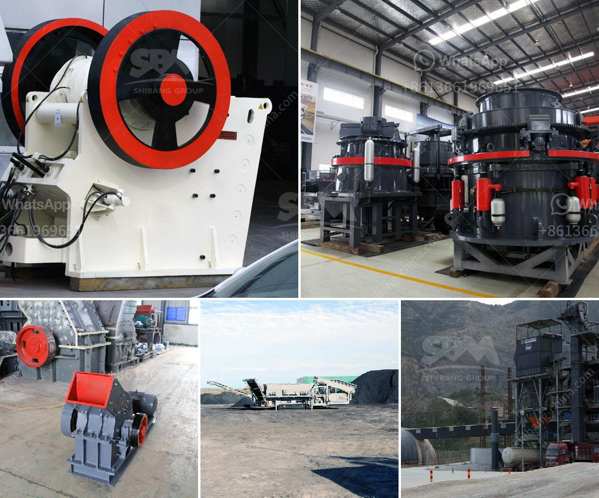

<h3>used clay powder drying machinery</h3>
Used clay powder drying machinery is an essential piece of equipment in the brick-making industry. Clay is one of the primary materials used in brick production, and it needs to be properly dried before it can be shaped and fired.

Clay is a fine-grained soil that contains a high percentage of minerals such as silica, alumina, and water. When clay is mined, it is often in a wet and muddy form. To transform it into usable clay, it must be dried thoroughly.

One of the most common types of machinery used for drying clay powder is a rotary dryer. This equipment consists of a rotating drum that is heated from inside. As the drum rotates, it moves the clay powder along with it, allowing for even drying.

The first stage of the drying process is the pre-heating stage. This is when the wet clay is introduced into the rotary dryer. Inside the dryer, hot air is circulated to heat the clay and remove the initial moisture content. The pre-heating stage is crucial as it helps prepare the clay for further drying.

After the pre-heating stage, the clay powder continues to move through the dryer while being exposed to hot air. The hot air helps evaporate the remaining moisture in the clay, leaving behind a dry powder. This process usually takes several hours to complete, depending on the initial moisture content and the desired level of dryness.

In addition to the rotary dryer, there are other types of machinery that can be used for drying clay powder. These include fluid bed dryers, spray dryers, and paddle dryers. Each of these machines has its unique features and advantages, depending on the specific requirements of the clay drying process.

Used clay powder drying machinery offers several benefits for brick manufacturers. Firstly, it increases production efficiency by reducing the amount of time required for the clay to dry. This allows for a faster turnaround time, ensuring a steady supply of dried clay powder for the brick-making process.

Secondly, using drying machinery ensures consistency in the clay drying process. By controlling variables such as temperature and airflow, manufacturers can achieve a consistent moisture content in the dried clay powder. This consistency is crucial for producing high-quality bricks with uniform properties.

Lastly, drying machinery helps reduce waste and maximize profitability. By efficiently removing moisture from the clay, manufacturers can achieve a higher yield of usable clay powder. This eliminates the need for additional drying cycles and reduces material wastage.

In conclusion, used clay powder drying machinery plays a crucial role in the brick-making industry. It enables manufacturers to transform wet and muddy clay into dry, workable powder efficiently. By utilizing drying machinery, brick manufacturers can improve production efficiency, achieve consistent clay moisture content, and minimize waste, ultimately maximizing profitability.
<h3>Contact us</h3><ul><li><strong>Whatsapp:&nbsp;<a href="https://wa.me/8613661969651">+8613661969651</a></strong></li><li><a href="https://swt.shibang-china.com/?git&amp;zhl&amp;used clay powder drying machinery"><strong>Online Service(chat now)</strong></a></li></ul><h3>Related</h3><ul><li><a href='gypsum making machine india.md'>gypsum making machine india</a></li><li><a href='pakistan directory of cement plants list pdf.md'>pakistan directory of cement plants list pdf</a></li><li><a href='big crusher stones east london south africa.md'>big crusher stones east london south africa</a></li><li><a href='jaw crusher seller in pakistan.md'>jaw crusher seller in pakistan</a></li><li><a href='crusher supplier in saudi arabia.md'>crusher supplier in saudi arabia</a></li></ul>