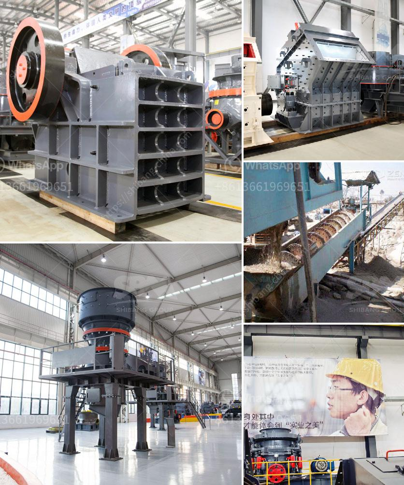

<h3>used coal washing plant sale</h3>
The coal industry is one of the largest and most important industries in the world. It contributes significantly to the global energy mix and plays a crucial role in the development of many economies. Coal is used to generate electricity, produce steel, and manufacture cement. As a result, coal washing plants are in high demand to ensure that the quality of coal being used in these industries meets stringent standards.

Coal washing plants utilize numerous techniques to separate impurities from coal, ensuring that the end product meets the specifications required by its intended application. These impurities can include dirt, rocks, minerals, sulfur, and other contaminants that have to be removed to enhance the efficiency of coal combustion.

Due to the rising awareness of environmental concerns and regulations on emissions, coal washing plants are becoming increasingly essential. With the use of advanced technology, these plants can remove a significant percentage of pollutants from coal, thereby reducing harmful emissions when it is burned.

While many countries are transitioning towards cleaner energy sources, such as renewable energy, coal is still widely used, particularly in developing nations. Therefore, the demand for coal washing plants is expected to remain steady for the foreseeable future.

In recent times, there has been a surge in the sale of used coal washing plants, as companies look to upgrade their equipment and replace older machines. There are several advantages to purchasing a used plant. Firstly, it can be a cost-effective option for those on a tight budget. Used plants are typically sold at a fraction of the cost of new ones, making them an attractive choice for smaller companies or those looking to expand their operations without investing heavily.

Secondly, used coal washing plants have often been well-maintained and are still in good working condition. Many companies take great care of their equipment, ensuring that it remains efficient and effective throughout its lifespan. Therefore, purchasing a used plant can be a reliable option, especially if it comes from a reputable source.

Furthermore, used coal washing plants can be readily available for sale, allowing businesses to acquire the equipment they need quickly. Waiting times for new plants can be lengthy, as manufacturers often have a backlog of orders. This can cause delays in production and limit a company's ability to meet demand. By opting for a used plant, businesses can minimize downtime and maintain a steady flow of operations.

It is important to note that when considering the purchase of a used coal washing plant, thorough due diligence is necessary. Potential buyers should inspect the equipment, check its maintenance history, review its performance records and consult with industry experts before making a final decision.

In conclusion, the sale of used coal washing plants offers an opportunity for businesses to upgrade their equipment cost-effectively while also promoting sustainable business practices. With the demand for coal washing plants expected to remain steady, the availability of used plants presents a viable option for companies looking to enhance their operations and meet industry standards. As the industry continues to evolve, finding innovative ways to reduce environmental impact and improve efficiency will remain a key priority, and used coal washing plants can play a crucial role in achieving these objectives.
<h3>Contact us</h3><ul><li><strong>Whatsapp:&nbsp;<a href="https://wa.me/8613661969651">+8613661969651</a></strong></li><li><a href="https://swt.shibang-china.com/?git&amp;zhl&amp;used coal washing plant sale"><strong>Online Service(chat now)</strong></a></li></ul><h3>Related</h3><ul><li><a href='gyratory crusher prices.md'>gyratory crusher prices</a></li><li><a href='tonnes per year cement plant machinary.md'>tonnes per year cement plant machinary</a></li><li><a href='stone crusher in ksa.md'>stone crusher in ksa</a></li><li><a href='china talc processing factory rental ghana.md'>china talc processing factory rental ghana</a></li><li><a href='small motor ore crusher for home.md'>small motor ore crusher for home</a></li></ul>