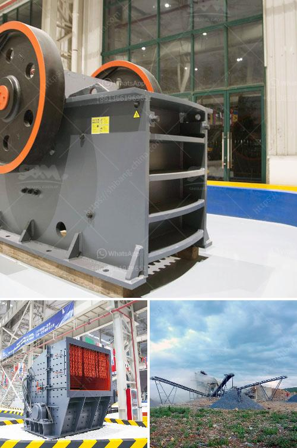

<h3>used concrete crushers for sale in ontario</h3>
Used concrete crushers for sale in Ontario offer the versatility and portability required for small to medium-sized projects. Contractors and homeowners alike can navigate the market and find the ideal attachment for their needs at an affordable price.

Concrete crushers are heavy-duty machines designed to break down large chunks of concrete into smaller, more manageable pieces. They are commonly used in construction sites and demolition projects to crush concrete waste and recycle it for future use. The versatility of concrete crushers allows them to be employed in various applications, such as road construction, foundation work, and landscaping.

One of the main advantages of using a used concrete crusher is its cost-effectiveness. Purchasing a used crusher can be significantly cheaper than buying a new one, making it an attractive option for contractors on a tight budget. Additionally, used crushers retain their value well, so if the need arises to sell the equipment in the future, it can still yield a good return on investment.

When searching for used concrete crushers for sale in Ontario, it is essential to consider the specific needs of your project. Determine the size and type of concrete debris you will be working with to choose a crusher with the appropriate capacity and design. Some crushers are better suited for breaking down thick slabs, while others excel at crushing reinforced concrete or separating rebar from the concrete.

It is also important to assess the condition of the used crusher before making a purchase. Look for signs of wear and tear, such as rust, cracks, or leaks, as they can indicate potential maintenance or performance issues. Visually inspect the hydraulic system to ensure it operates smoothly and effectively. If possible, request a demonstration or test run of the machine to assess its overall functionality.

Another factor to consider when purchasing a used concrete crusher is its compatibility with your existing equipment. Check if the crusher attachment is compatible with your excavator or skid steer, as this will save you time and money on additional modifications or adaptors. Pay attention to the crusher's weight and dimensions to ensure they align with the lifting capabilities of your equipment.

To find used concrete crushers for sale in Ontario, start by exploring online classified websites, equipment auctions, and dealer websites. Many reputable sellers offer detailed descriptions, photos, and specifications of the used crushers in their inventory, making it easier to compare options and make an informed decision. Reach out to sellers directly to ask questions or request additional information about the equipment.

In conclusion, used concrete crushers for sale in Ontario provide cost-effective solutions for contractors and homeowners looking to crush concrete waste and recycle it for future use. By considering the specific needs of your project, assessing the condition of the equipment, and ensuring compatibility with your existing machinery, you can find a used crusher that meets your requirements without breaking the bank. Start your search today and take advantage of the available options in the market!
<h3>Contact us</h3><ul><li><strong>Whatsapp:&nbsp;<a href="https://wa.me/8613661969651">+8613661969651</a></strong></li><li><a href="https://swt.shibang-china.com/?git&amp;zhl&amp;used concrete crushers for sale in ontario"><strong>Online Service(chat now)</strong></a></li></ul><h3>Related</h3><ul><li><a href='price crusher mill price stone crusher.md'>price crusher mill price stone crusher</a></li><li><a href='mining equipment for sale.md'>mining equipment for sale</a></li><li><a href='machine that to crush rock.md'>machine that to crush rock</a></li><li><a href='used cement mills for sale in india.md'>used cement mills for sale in india</a></li><li><a href='granite crusher south africa.md'>granite crusher south africa</a></li></ul>