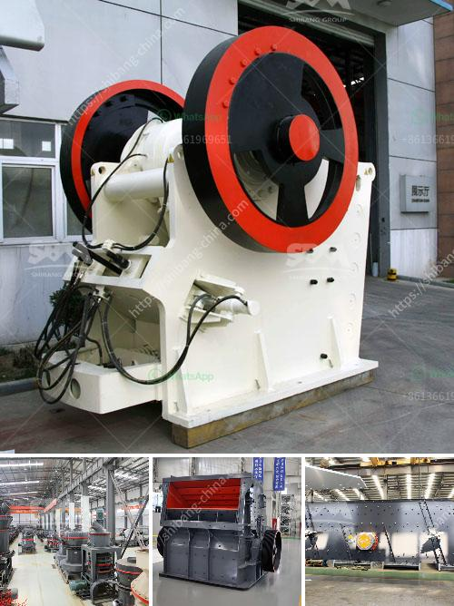

<h3>used concrete mixer for sale dubai</h3>
If you are in the construction business, having a reliable concrete mixer is an absolute necessity. A concrete mixer is a tool that allows you to mix sand, gravel, water, and cement to create the perfect concrete mixture for your projects. However, investing in a brand new concrete mixer can be quite expensive, especially for small or startup businesses. This is where the option of purchasing a used concrete mixer for sale in Dubai comes into play.

Dubai, being a booming hub for construction activities, offers a wide range of options when it comes to purchasing used concrete mixers. These mixers are often in good condition and are available at a fraction of the cost of a new one. Here are a few reasons why buying a used concrete mixer in Dubai can be a smart decision.

Cost-Effective Solution: One of the main advantages of purchasing a used concrete mixer is the significant cost savings. A brand new mixer can be quite expensive, especially for businesses on a tight budget. By opting for a used mixer, you can save a substantial amount of money and allocate it to other aspects of your construction project. With the same functionality and performance, a used mixer can deliver the desired results without breaking the bank.

Reliable Quality: Concrete mixers are built to withstand heavy usage and tough working conditions. Many used mixers available in Dubai are still in great condition and can offer similar performance to a new one. Before putting up a used mixer for sale, sellers often inspect and service the equipment to ensure it is in proper working order. You can also request additional information or ask for a demonstration before finalizing your purchase.

Variety of Options: Dubai boasts a diverse marketplace when it comes to purchasing used construction equipment, including concrete mixers. You can find different models, brands, and sizes of mixers based on your specific requirements. This allows you to choose a mixer that suits your needs and preferences without compromising on quality. Whether you need a smaller portable mixer for small-scale projects or a larger industrial mixer for more substantial construction sites, there is a wide range of options to choose from in Dubai.

Ease of Access: The construction industry in Dubai is constantly growing, which means there is a continuous supply of used concrete mixers available for sale. You can easily find listings online or through local dealerships that specialize in selling used construction equipment. With a little research and due diligence, you can connect with reliable sellers and make a purchase that aligns with your budget and preferences.

In conclusion, investing in a used concrete mixer for sale in Dubai can be a wise decision for businesses in the construction industry. Not only does it provide a cost-effective solution, but it also offers reliable quality, a variety of options, and ease of access. By choosing to buy a used concrete mixer, you can save money while still ensuring you have the reliable equipment needed for your construction projects.
<h3>Contact us</h3><ul><li><strong>Whatsapp:&nbsp;<a href="https://wa.me/8613661969651">+8613661969651</a></strong></li><li><a href="https://swt.shibang-china.com/?git&amp;zhl&amp;used concrete mixer for sale dubai"><strong>Online Service(chat now)</strong></a></li></ul><h3>Related</h3><ul><li><a href='stone crusher plan dwg.md'>stone crusher plan dwg</a></li><li><a href='wanted 120 ton of stone crusher.md'>wanted 120 ton of stone crusher</a></li><li><a href='cone crusher for sale in ghana.md'>cone crusher for sale in ghana</a></li><li><a href='sand stone factory equipment.md'>sand stone factory equipment</a></li><li><a href='purchase of cement crusher machines.md'>purchase of cement crusher machines</a></li></ul>