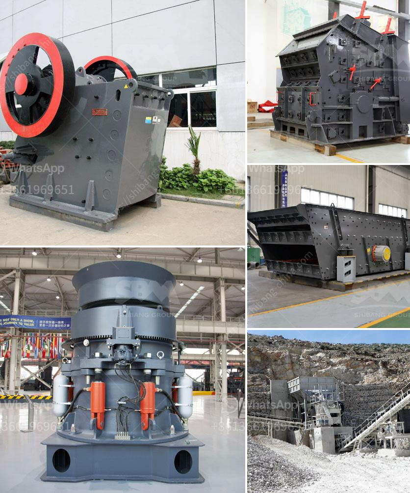

<h3>used conveyor belt for sale europe</h3>
In Europe's thriving industrial sector, a crucial component for efficient material handling is the conveyor belt. While investing in brand new conveyor belts may not always be the most cost-effective option for businesses, the market for used conveyor belts in Europe has gained traction as a sustainable and affordable alternative. This article explores the benefits and considerations when it comes to purchasing used conveyor belts for sale in Europe.

One of the primary advantages of opting for used conveyor belts is cost savings. Industrial operations often require extensive conveyor systems, which can be overwhelmingly expensive when purchasing new belts. Fortunately, the availability of used conveyor belts for sale in Europe provides a budget-friendly alternative for businesses looking to streamline their production processes without breaking the bank.

Contrary to what some may assume, used conveyor belts in Europe possess the same durability and quality as their new counterparts. Conveyor belts are manufactured to withstand rigorous wear and tear, meaning those available in the used market still have ample service life left. European industries adhere to stringent regulations concerning conveyor belt safety, ensuring the reliability and durability of used belts in the market.

Used conveyor belts offer endless possibilities for a wide range of industries. From manufacturing plants and logistics centers to mining operations and agricultural facilities, these belts can facilitate the movement of goods, materials, and components across various stages of production. The versatility of these belts allows them to thrive in virtually any sector that relies on a robust and efficient conveyor system.

Choosing used conveyor belts is also an environmentally-conscious decision. By extending the lifespan of these belts, businesses reduce their dependence on new raw materials for manufacturing new belts. This resource-saving approach minimizes waste and decreases the environmental impact associated with conveyor belt production. By opting for used belts, industries in Europe actively contribute to a more sustainable future.

While purchasing used conveyor belts can yield significant benefits, it is essential to consider certain factors to ensure a successful acquisition. Buyers should evaluate the condition of the belts, including any signs of wear, tear, or damage. It is recommended to seek assistance from professionals well-versed in conveyor systems who can assess the belts' suitability and provide guidance on compatibility with existing infrastructure.

The availability of used conveyor belts for sale in Europe has introduced a sustainable and cost-effective solution for the region's industrial sector. With their reliable durability, versatility, and environmental benefits, used conveyor belts have garnered increasing popularity. By choosing these belts, businesses not only reduce costs but also contribute to a more sustainable future. When considering a purchase, seeking guidance from experts ensures a seamless integration of used conveyor belts into existing operations, facilitating the smooth flow of materials and enhancing productivity across European industries.
<h3>Contact us</h3><ul><li><strong>Whatsapp:&nbsp;<a href="https://wa.me/8613661969651">+8613661969651</a></strong></li><li><a href="https://swt.shibang-china.com/?git&amp;zhl&amp;used conveyor belt for sale europe"><strong>Online Service(chat now)</strong></a></li></ul><h3>Related</h3><ul><li><a href='used conveyor belt for sale europe.md'>used conveyor belt for sale europe</a></li><li><a href='stone crusher rent based mobile machine.md'>stone crusher rent based mobile machine</a></li><li><a href='business plan south africa stone crusher.md'>business plan south africa stone crusher</a></li><li><a href='single toggle jaw crusher.md'>single toggle jaw crusher</a></li><li><a href='300kg to 500kg ball mill.md'>300kg to 500kg ball mill</a></li></ul>