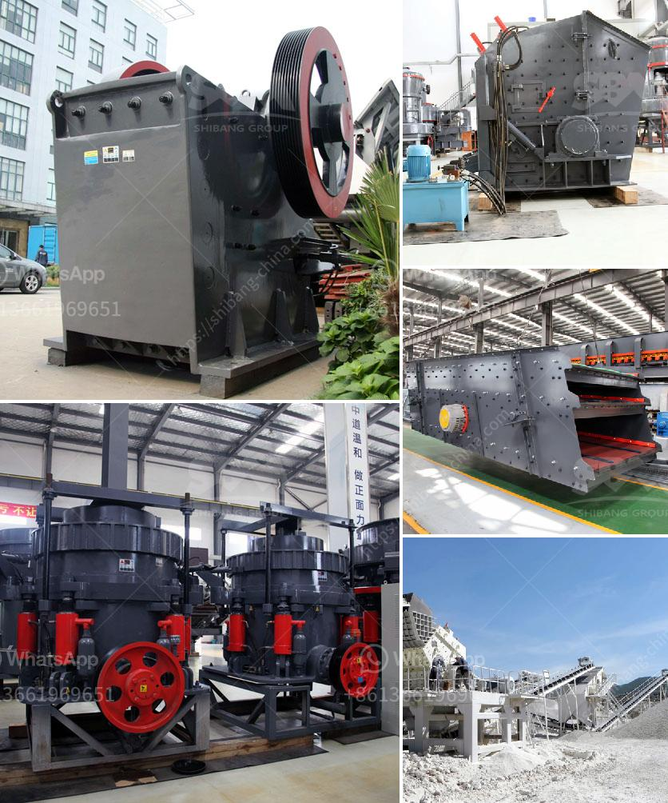

<h3>used crusher equipment south africa</h3>
South Africa is known for its mining industry and is a major player in global mining productions. With abundant mineral resources and a well-developed infrastructure, South Africa is the perfect destination for mining and exploration projects. When it comes to crushing equipment, South Africa remains at the forefront, with several high-quality options available.

Used crusher equipment is an excellent choice for industrial purposes. Crushing machines are used to break down large rocks, stones, and other materials into smaller size for further processing. This process is vital for various industries, including mining, construction, recycling, metallurgy, and more.

Cost-effective and efficient, used crusher equipment offers several benefits. Firstly, it allows businesses to save money as purchasing brand new machinery can be expensive. With used crushers, you can get the same high-quality equipment at a fraction of the cost. This is particularly beneficial for smaller businesses or those operating on a tight budget.

Secondly, used crusher equipment in South Africa is readily available and easy to access. Many reputable dealers and suppliers offer a wide range of used crushers, ensuring that businesses can find the perfect equipment to suit their specific needs. These suppliers often provide valuable guidance and support, helping businesses make informed decisions about their crusher equipment.

Thirdly, used crusher equipment in South Africa is reliable and durable. The equipment undergoes rigorous inspections and maintenance checks, ensuring that it is in excellent working condition. Businesses can have peace of mind, knowing that their used crusher equipment will perform optimally and provide efficient results.

Lastly, used crusher equipment in South Africa is easily customizable. Each business has unique requirements and specifications when it comes to their crushing machines. Used equipment can be modified and customized to fit these specific needs, ensuring that businesses can maximize their productivity and output.

In conclusion, used crusher equipment in South Africa is an affordable and practical option for businesses looking to enhance their industrial operations. With cost savings, easy access, reliability, and customization options, used crusher equipment provides excellent value for money. Whether you are in the mining, construction, or recycling industry, considering used crusher equipment for your operations in South Africa is a smart move.
<h3>Contact us</h3><ul><li><strong>Whatsapp:&nbsp;<a href="https://wa.me/8613661969651">+8613661969651</a></strong></li><li><a href="https://swt.shibang-china.com/?git&amp;zhl&amp;used crusher equipment south africa"><strong>Online Service(chat now)</strong></a></li></ul><h3>Related</h3><ul><li><a href='marble crusher and grinding machinery.md'>marble crusher and grinding machinery</a></li><li><a href='marble crusher industry philippines.md'>marble crusher industry philippines</a></li><li><a href='biering roller mill.md'>biering roller mill</a></li><li><a href='coal powder plant.md'>coal powder plant</a></li><li><a href='list of all the equipment for gold mining.md'>list of all the equipment for gold mining</a></li></ul>