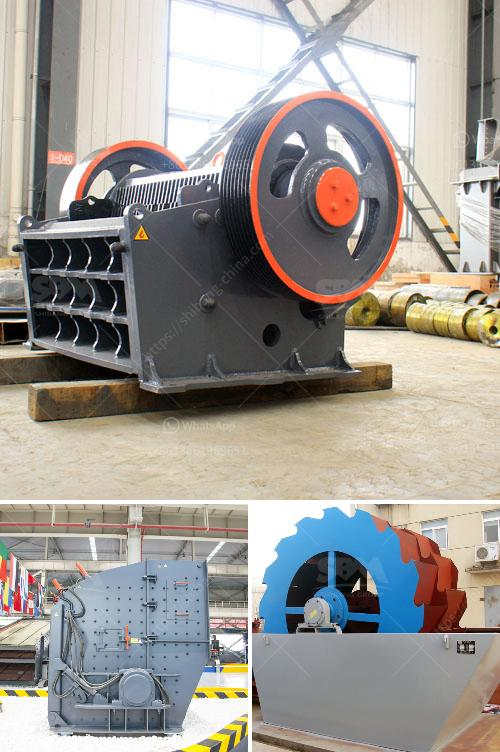

<h3>used crusher for sale from iran</h3>
When it comes to heavy-duty machinery, such as crushers, finding the right equipment at an affordable price is crucial for businesses in various industries. In recent years, Iran has become a major hub for used crushers for sale, offering a wide range of options for both local and international buyers. This article will shed light on the advantages and considerations of purchasing used crushers from Iran.

One of the primary advantages of investing in used crushers for sale from Iran is the cost-effectiveness. Compared to purchasing brand-new crushers, used crushers offer substantial cost savings. Iran's booming construction and mining sectors have led to a significant increase in the availability of pre-owned crushers in excellent working condition. Buyers can acquire top-quality crushers at a fraction of the price, providing an excellent return on investment.

Iran's used crusher market provides buyers with a wide range of options to suit their specific needs. Whether you're looking for jaw crushers, cone crushers, impact crushers, or even specialized equipment for specific industries, Iran's used crusher market has it all. Moreover, many sellers in Iran offer customized solutions by working closely with buyers to understand their unique requirements, ensuring the right crusher is sourced.

While purchasing used crushers, concerns about the equipment's quality are natural. However, buyers need not worry when it comes to crushers for sale from Iran. The country is known for its strict quality control and maintenance standards, ensuring that the used crushers are in excellent working conditions. Many sellers in Iran conduct comprehensive inspections and refurbish the equipment as needed before listing them for sale, ensuring buyers receive reliable and durable crushers.

Choosing used crushers from Iran comes with the added advantage of support and after-sales service. Many sellers offer expert assistance to their clients, providing guidance on selecting the right equipment based on the specific requirements and site conditions. Furthermore, they also provide comprehensive after-sales service, including installation, warranty, and maintenance support, ensuring buyers have a hassle-free experience with their purchase.

While purchasing used crushers from Iran presents numerous benefits, buyers should consider a few key factors to ensure a successful transaction:

a) Thorough Inspection: Prior to finalizing the purchase, buyers should conduct a thorough inspection of the equipment, either personally or through a trusted agent, to verify the quality and condition of the crusher.

b) Purchase Agreements: It is essential to establish a written purchase agreement that outlines all the terms and conditions, including warranties, returns, and guarantees. This protects the interests of both the buyer and the seller.

c) Logistics and Transportation: Buyers should carefully plan the logistics and transportation of the purchased crushers to minimize any potential risks or delays. It is advisable to work with experienced logistics companies to ensure efficient and safe delivery.

Acquiring used crushers for sale from Iran offers businesses a cost-effective and reliable solution to their crushing equipment needs. With an extensive range of options, assurance of quality, and excellent after-sales service, buyers can confidently embark on their crusher purchase journey. However, it is crucial to conduct due diligence and consider various factors to ensure a successful transaction. By doing so, businesses can efficiently streamline their operations and boost their productivity with top-quality crushers acquired at competitive prices.
<h3>Contact us</h3><ul><li><strong>Whatsapp:&nbsp;<a href="https://wa.me/8613661969651">+8613661969651</a></strong></li><li><a href="https://swt.shibang-china.com/?git&amp;zhl&amp;used crusher for sale from iran"><strong>Online Service(chat now)</strong></a></li></ul><h3>Related</h3><ul><li><a href='stone crusher vibrating screen for sale.md'>stone crusher vibrating screen for sale</a></li><li><a href='cost of setting up a mini cement plant in india.md'>cost of setting up a mini cement plant in india</a></li><li><a href='iron ore crusher machine price.md'>iron ore crusher machine price</a></li><li><a href='prices crusher prices gypsum crusher prices.md'>prices crusher prices gypsum crusher prices</a></li><li><a href='belt conveyor level.md'>belt conveyor level</a></li></ul>