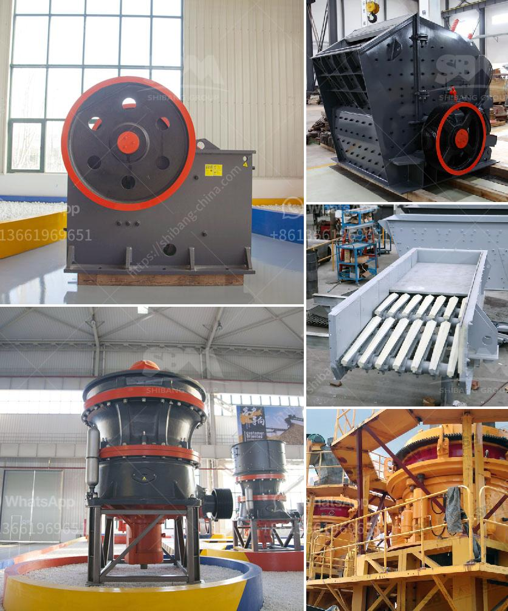

<h3>used crusher for sale in dubai</h3>
Dubai, known for its extravagant lifestyle and luxurious infrastructure, is a prime destination for individuals seeking the finer things in life. However, amidst the glitz and glamour, there lies a thriving second-hand market for various goods, including used crushers.

A crusher is a machine designed to reduce large rocks into smaller rocks, gravel, or rock dust. It is an essential component in construction, mining, and various other industries. With the rapid development of Dubai's infrastructure, there is a growing demand for crushers, as more projects are being initiated.

For those with a limited budget, purchasing a used crusher can be a cost-effective solution. In Dubai's thriving second-hand market, individuals can find a wide range of crushers that are in good working condition and available at a fraction of the original price. These crushers are often sourced from larger construction and mining companies that are upgrading their equipment or reducing their fleet size.

Several reputable dealers in Dubai specialize in selling used crushers, ensuring that customers have access to quality machinery. These dealers thoroughly inspect the crushers before putting them up for sale, ensuring that they meet stringent quality standards. They also provide the necessary technical information about the crushers, such as operating conditions and maintenance history, giving buyers peace of mind.

Purchasing a used crusher has numerous advantages. Firstly, it allows individuals to acquire high-quality machinery without breaking the bank. Secondly, it enables businesses to expand their operations quickly, as they can acquire the necessary equipment at a lower cost. Lastly, by opting for a used crusher, individuals contribute to sustainable practices by reducing waste and carbon footprint.

However, buyers must exercise caution when purchasing used crushers. It is crucial to thoroughly inspect the machine, ensuring that it is in working order and does not require costly repairs. Buyers should also consider their specific requirements and select a crusher model suitable for their intended use.

In conclusion, the used crusher market in Dubai offers individuals and businesses an opportunity to acquire high-quality machinery at an affordable price. With a wide range of crushers available, buyers can find the perfect machine to meet their needs. By opting for a used crusher, individuals can contribute to sustainable practices while enjoying the benefits of cost savings.
<h3>Contact us</h3><ul><li><strong>Whatsapp:&nbsp;<a href="https://wa.me/8613661969651">+8613661969651</a></strong></li><li><a href="https://swt.shibang-china.com/?git&amp;zhl&amp;used crusher for sale in dubai"><strong>Online Service(chat now)</strong></a></li></ul><h3>Related</h3><ul><li><a href='raymond mill model.md'>raymond mill model</a></li><li><a href='cone crusher for sale in ghana.md'>cone crusher for sale in ghana</a></li><li><a href='calcium roller mill.md'>calcium roller mill</a></li><li><a href='pakistan chromite crusher equipment.md'>pakistan chromite crusher equipment</a></li><li><a href='talc production process.md'>talc production process</a></li></ul>