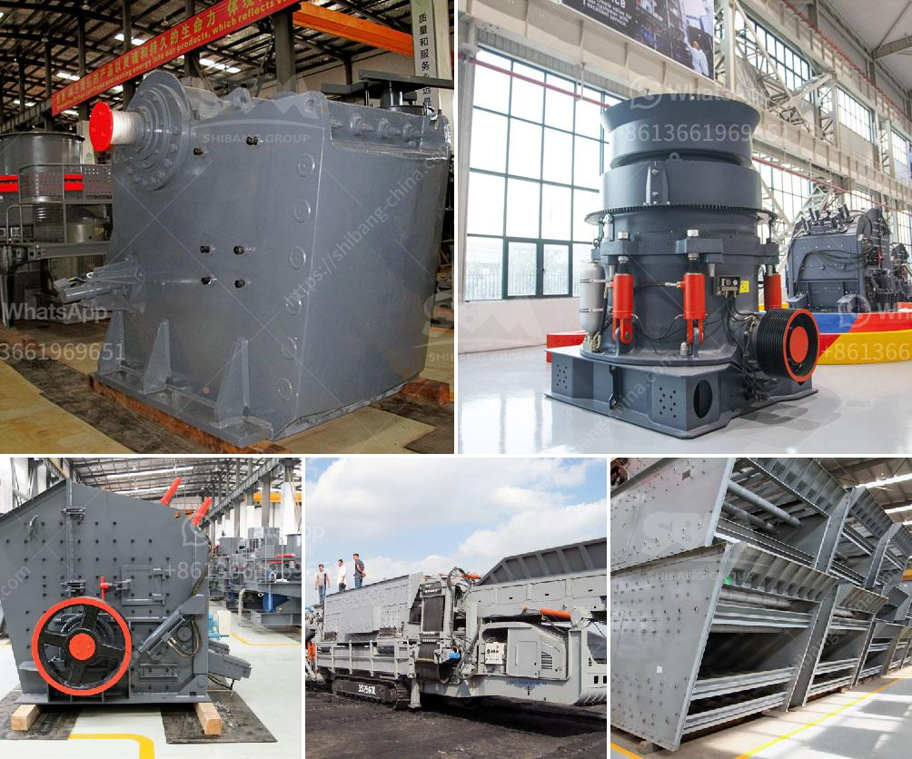

<h3>used crusher for sale in pakistan</h3>
One of the most commonly used crushing devices is a crusher. Crusher is mainly used for crushing chunks of coal and iron ore in large processing plants or coal preparation plants. It mainly consists of a rotating shaft and a conical head, both of which are driven by motors. Crusher is used in various industries such as mining, metallurgy, chemical and construction. In recent years, the demand for crushers in Pakistan has been growing rapidly due to the high demand for aggregate materials.

Crushers in Pakistan are used for crushing stones into small pieces for construction project purposes. There are different types of crushers that are used for crushing stones including jaw crushers, cone crushers, hammer mills and impact crushers. Each of these types has different features and are suitable for different production situations.

When choosing a crusher, it is important to consider factors such as the hardness of the stone, the required output size, and the shape of the final product. Additionally, the cost of the crusher and the usage cost should also be taken into account. For those who have a limited budget or need a crusher for a short period, a used crusher can be a cost-effective option.

There are many advantages to buying a used crusher in Pakistan. Firstly, used crushers are readily available in the market and you can have access to many options depending on your needs. Secondly, the cost of a used crusher is significantly lower than a new one, which can save you a lot of money. This is especially beneficial for small construction projects or for companies that are just starting out.

Another advantage of buying a used crusher is that it has already been tested and proven to be reliable. This means that you can have confidence in its performance and durability. Additionally, if the used crusher comes with a warranty, you can be assured that any defects or issues will be resolved by the seller.

However, before purchasing a used crusher, it is important to thoroughly inspect the machine and ensure that it is in good working condition. Check for any signs of wear and tear, such as rust or loose parts, and test the machine to see if it operates smoothly. It is also advisable to ask for the maintenance records and service history of the crusher to get a better understanding of its previous usage.

In conclusion, a used crusher can be an excellent option for those who are looking for a cost-effective solution for their crushing needs in Pakistan. By carefully inspecting the machine and considering its features, cost, and warranty, you can find a reliable used crusher that meets your requirements. Whether you need a crusher for a small construction project or a large-scale mining operation, a used crusher can provide the functionality and performance you need at a fraction of the cost.
<h3>Contact us</h3><ul><li><strong>Whatsapp:&nbsp;<a href="https://wa.me/8613661969651">+8613661969651</a></strong></li><li><a href="https://swt.shibang-china.com/?git&amp;zhl&amp;used crusher for sale in pakistan"><strong>Online Service(chat now)</strong></a></li></ul><h3>Related</h3><ul><li><a href='calcium carbonate ball milling.md'>calcium carbonate ball milling</a></li><li><a href='indonesia coal crusher stamler agent.md'>indonesia coal crusher stamler agent</a></li><li><a href='ball mill pictures.md'>ball mill pictures</a></li><li><a href='ultra fine grinding equipment.md'>ultra fine grinding equipment</a></li><li><a href='ansporting coal conveyor belt.md'>ansporting coal conveyor belt</a></li></ul>