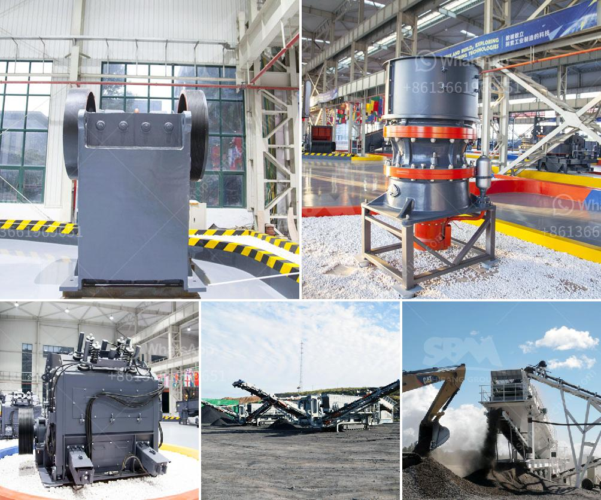

<h3>used crusher for sale in tanzania</h3>
If you are in the market for a used crusher for sale in Tanzania, you may have some difficulty finding options. However, there are still various suppliers and sources that can provide you with high-quality crushing equipment suited for different requirements and budgets.

Crushers are essential machines used in the mining and quarrying industry to break down large rocks into smaller, more manageable pieces. They play a vital role in the construction industry, as well as in the production of aggregates and other materials used in various applications.

Purchasing a used crusher can offer several advantages over buying a brand-new one. One of the key benefits is cost savings. Used crushers are generally priced lower than new ones, allowing you to save a significant amount of money. This is particularly beneficial for small to medium-sized businesses or contractors operating on a tighter budget.

Another advantage is the availability of different models and types of crushers. Depending on your specific requirements, you can find used crushers that are suitable for primary or secondary crushing, such as jaw crushers, cone crushers, impact crushers, and gyratory crushers. Additionally, there are various sizes and capacities available, ensuring you can find a crusher that meets your production needs.

To find a used crusher for sale in Tanzania, you can explore different avenues. Some popular options include:

1. Online platforms: Utilize online marketplaces, auction websites, or classified advertisements to search for used crushers. These platforms often provide detailed information, specifications, and photos of the crushers, helping you make an informed decision. It's essential to research the reputation of the sellers and inspect the equipment thoroughly before making a purchase.

2. Local dealers and brokers: Contact local machinery dealers or brokers who specialize in the sale of used crushers. They can provide you with a range of options and guide you through the buying process, ensuring you find the most suitable crusher for your needs.

3. Industry networks and associations: Join relevant industry networks and associations to connect with fellow professionals and inquire about any used crushers available for sale. Often, industry insiders have access to exclusive information and can help you find reliable sources for used machinery.

Before finalizing a purchase, it is crucial to inspect the used crusher thoroughly to assess its condition and ensure it meets your requirements. Check for any visible wear and tear, examine the performance and functioning of the machinery, and inspect the maintenance records to understand any previous issues. If possible, request a test run to see the crusher in action.

Additionally, consider the after-sales support and warranty being offered by the seller. Some sellers may provide limited warranties or technical support for a certain period, ensuring you have peace of mind and assistance if any issues arise after the purchase.

In conclusion, if you are in the market for a used crusher for sale in Tanzania, it is possible to find high-quality equipment suitable for your needs. Explore online platforms, contact local dealers and brokers, and utilize industry networks to connect with potential sellers. Carefully inspect the crusher and consider after-sales support before making a purchase. With thorough research and due diligence, you can find a used crusher that meets your requirements and budget, helping you optimize your operations and achieve your production goals.
<h3>Contact us</h3><ul><li><strong>Whatsapp:&nbsp;<a href="https://wa.me/8613661969651">+8613661969651</a></strong></li><li><a href="https://swt.shibang-china.com/?git&amp;zhl&amp;used crusher for sale in tanzania"><strong>Online Service(chat now)</strong></a></li></ul><h3>Related</h3><ul><li><a href='ball milling method.md'>ball milling method</a></li><li><a href='stone crusher for tractors.md'>stone crusher for tractors</a></li><li><a href='ball mill size.md'>ball mill size</a></li><li><a href='feldspar powder machine.md'>feldspar powder machine</a></li><li><a href='stone crusher finding.md'>stone crusher finding</a></li></ul>