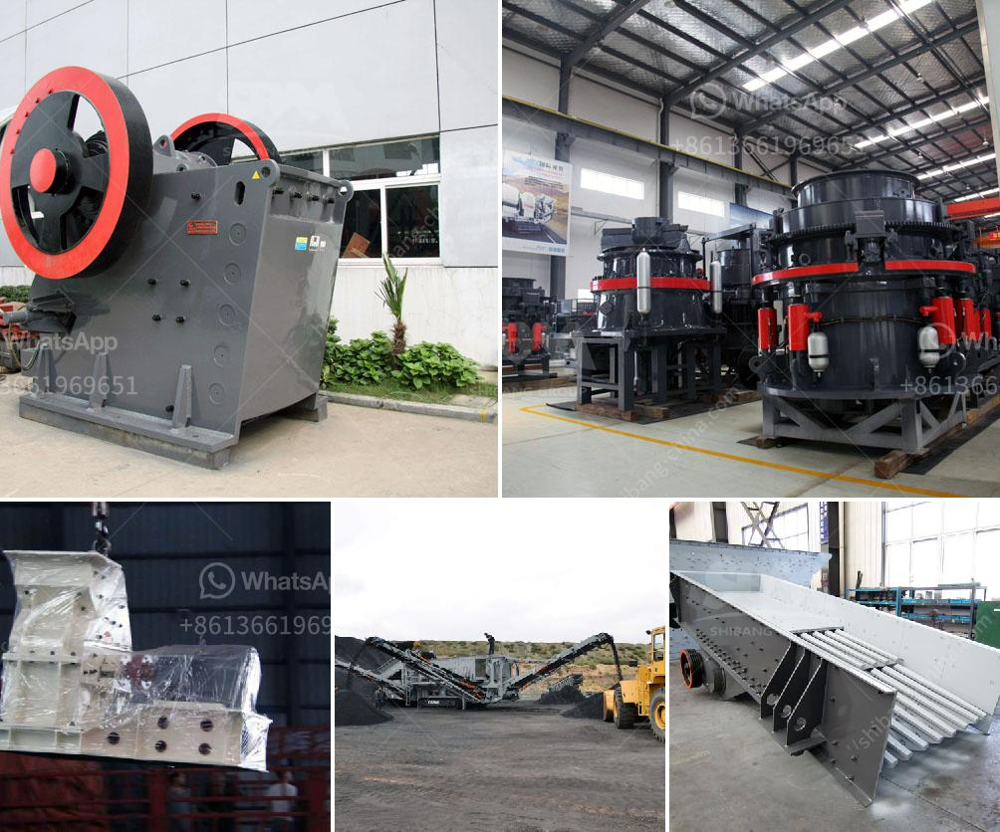

<h3>used crushing quarry plant in south africa</h3>
The mining industry in South Africa is thriving due to the abundance of minerals in the country. Quarrying is an essential process in extracting valuable minerals and materials for further processing. However, quarrying activities also have environmental and social impacts, making it crucial to adopt sustainable practices.

One way to promote sustainability in the quarrying industry is through the use of used crushing quarry plants. These plants are refurbished and repurposed machinery that can efficiently crush and process materials in a cost-effective manner. By utilizing used crushing quarry plants, mining companies in South Africa can reduce their environmental footprint and optimize their operations.

Firstly, using second-hand crushing quarry plants is a more sustainable approach compared to purchasing new machinery. Manufacturing new equipment often requires large amounts of energy and resources, leading to higher carbon emissions and environmental damage. By reusing and refurbishing existing plants, mining companies can significantly reduce their carbon footprint and minimize their impact on the environment.

Secondly, opting for used crushing quarry plants also provides financial benefits. Acquiring brand new machinery can be a considerable investment, especially for small and medium-sized mining companies. On the other hand, used plants are more affordable, offering cost-effective solutions without compromising the quality and efficiency of the crushing process. This allows mining companies to allocate their resources wisely and invest in other areas of their operations, such as safety measures or community development projects.

Thirdly, using used crushing quarry plants enhances the circular economy in the mining industry. The circular economy is a system that aims to minimize waste and maximize resource efficiency. By repurposing and recommissioning existing machinery, mining companies can contribute to the circular economy by extending the lifespan of equipment and reducing waste generation. This approach aligns with international sustainability goals and sets an example for other industries to adopt similar practices.

Moreover, the availability of used crushing quarry plants in South Africa provides opportunities for local job creation and economic development. Refurbishing and maintaining these plants require skilled labor, creating employment opportunities for technicians, engineers, and support staff. Furthermore, the reduced cost of used plants enables mining companies to invest in local communities through corporate social responsibility initiatives. This can include supporting education and skills development programs or contributing to community infrastructure projects.

In conclusion, the use of used crushing quarry plants in South Africa offers numerous benefits to the mining industry. From reducing environmental impact to promoting the circular economy and stimulating local economic development, it is a sustainable and economically viable alternative to purchasing new machinery. As the demand for minerals continues to grow, it is essential for mining companies to embrace sustainable practices and adopt innovative solutions to ensure the long-term viability of the industry.
<h3>Contact us</h3><ul><li><strong>Whatsapp:&nbsp;<a href="https://wa.me/8613661969651">+8613661969651</a></strong></li><li><a href="https://swt.shibang-china.com/?git&amp;zhl&amp;used crushing quarry plant in south africa"><strong>Online Service(chat now)</strong></a></li></ul><h3>Related</h3><ul><li><a href='cement grinding unit 100 tpd total.md'>cement grinding unit 100 tpd total</a></li><li><a href='marble and granite grinder and crusher.md'>marble and granite grinder and crusher</a></li><li><a href='stone crushing machines south africa.md'>stone crushing machines south africa</a></li><li><a href='vibrating feeder sinter oret.md'>vibrating feeder sinter oret</a></li><li><a href='aggregate crusher plants.md'>aggregate crusher plants</a></li></ul>