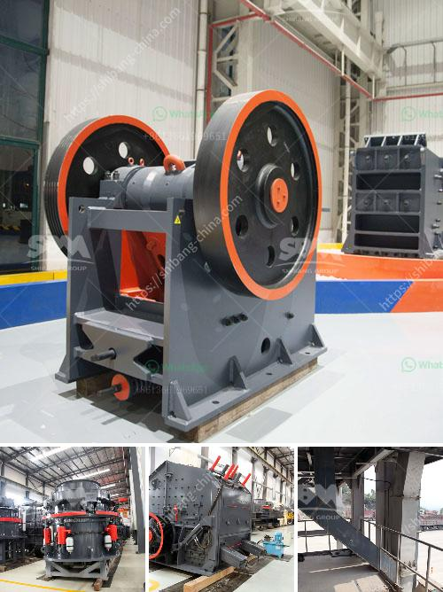

<h3>used dolomite jaw crusher price malaysia</h3>
The demand for construction materials is constantly growing, and the need for efficient and cost-effective crushing equipment is now more important than ever. In Malaysia, one of the key players in the industry is the dolomite jaw crusher. This machine has a long history and has been proven to be a reliable and efficient crusher for many years.

Dolomite jaw crusher is a popular model in the market. Due to its crushing ratio, high efficiency, and low energy consumption, it has been widely used in the processing of dolomite and other minerals in the construction, chemical, and mining industries. The machine is robust and durable, making it suitable for heavy-duty applications in various operating conditions.

When it comes to purchasing a used dolomite jaw crusher, price is always a key consideration. The market for used equipment offers a cost-effective solution for businesses looking to expand their operations without the high cost of purchasing new equipment. However, it is essential to evaluate the condition and quality of the used crusher before making a purchase.

The price of a used dolomite jaw crusher in Malaysia can vary significantly depending on factors such as the age of the machine, the condition, and its specifications. By conducting thorough research and comparing multiple listings, buyers can find a suitable crusher at an affordable price. It is recommended to consult with trusted dealers or sellers who are known for their expertise in the industry.

When evaluating a used dolomite jaw crusher, there are several factors to consider. Firstly, check the overall condition of the machine. Look for signs of wear and tear, inspect the parts for any damage, and ensure that all components are in good working condition. It is also vital to verify the number of working hours and the maintenance history of the crusher.

Secondly, consider the specifications and features of the jaw crusher. Different models might have different capacities, feeding sizes, and output sizes. Assess your specific requirements and match them with the capabilities of the crusher to ensure optimal performance.

Lastly, compare prices from different sellers to determine if the price is reasonable and competitive in the market. Be cautious of extremely low prices, as they may indicate hidden issues or poor quality. Always aim for a balance between price and quality to make a sound investment.

In conclusion, a used dolomite jaw crusher can be a cost-effective solution for businesses looking to expand their operations. However, thorough research, evaluation, and comparison are crucial to finding a suitable crusher at the right price. With the growing demand for construction materials in Malaysia, investing in a reliable and efficient crusher is essential to stay competitive in the industry.
<h3>Contact us</h3><ul><li><strong>Whatsapp:&nbsp;<a href="https://wa.me/8613661969651">+8613661969651</a></strong></li><li><a href="https://swt.shibang-china.com/?git&amp;zhl&amp;used dolomite jaw crusher price malaysia"><strong>Online Service(chat now)</strong></a></li></ul><h3>Related</h3><ul><li><a href='bauxite processing plant project cost.md'>bauxite processing plant project cost</a></li><li><a href='grinding machine manufacturer for 300 mesh powder.md'>grinding machine manufacturer for 300 mesh powder</a></li><li><a href='raymond mills usa.md'>raymond mills usa</a></li><li><a href='cost of cassava milling machine in ghana.md'>cost of cassava milling machine in ghana</a></li><li><a href='barite beneficiation plant.md'>barite beneficiation plant</a></li></ul>