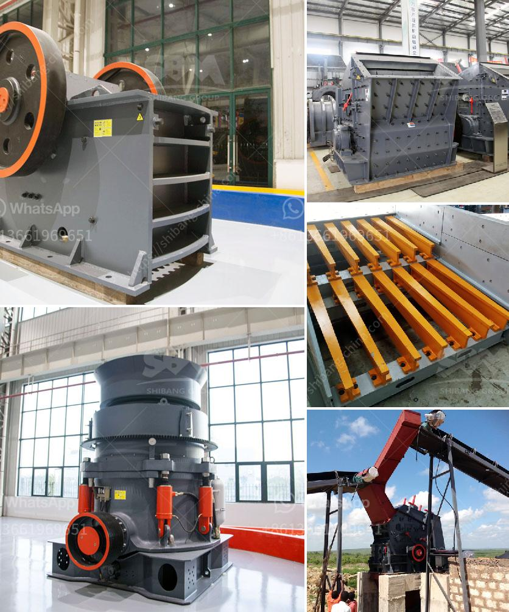

<h3>used equipment ball mill sale</h3>
Are you in search of affordable used equipment for your manufacturing business? Look no further, as we bring you an excellent option - used ball mills for sale! Ball mills have been used for decades to grind and mix materials used in the ceramic industry.

A ball mill is a cylindrical device used in grinding or mixing materials like ores, chemicals, ceramic raw materials, and paints. The ball mill rotates around a horizontal axis and is partially filled with the material to be ground, plus the grinding medium. Different materials are used as media, including ceramic balls, flint pebbles, and stainless steel balls. An internal cascading effect reduces the material to a fine powder.

By opting for used ball mills, businesses can save money on their capital expenditures. Used equipment costs significantly less than brand-new equipment, and yet, it can still deliver the same performance. Additionally, used ball mills can be easily inspected, tested, and repaired to ensure optimal operation. This gives buyers the assurance that they are investing in a reliable piece of equipment.

One might think that used equipment does not meet the same quality standards as new equipment. However, many companies specialize in refurbishing used ball mills, ensuring that they meet or even exceed the manufacturer's specifications. These refurbishments generally include replacing worn parts, repairing or replacing bearings, and ensuring proper alignment. Refurbished ball mills are thoroughly tested to guarantee their performance and efficiency.

When considering a purchase of a used ball mill, it is essential to evaluate the condition, operational history, and maintenance records of the equipment. This information can provide crucial insights into the machine's lifespan and potential issues. Additionally, obtaining the equipment's technical specifications can help determine if it is suitable for the particular application and production requirements.

Furthermore, purchasing used ball mills from reputable sellers provides buyers with expert advice and support. These sellers have extensive knowledge of the equipment and can guide buyers in making the right choice for their business needs. They can also offer assistance in installation, training, and troubleshooting, ensuring a smooth transition into using the equipment.

Used ball mills are ideal for manufacturers looking to set up a new production line or expand their existing facilities. Whether you are in the ceramic industry, the pharmaceutical industry, or any other industry that requires grinding or mixing materials, a used ball mill can be a cost-effective solution.

In conclusion, if you are searching for affordable and reliable equipment for your manufacturing needs, consider used ball mills for sale. These machines can provide the same performance as new ones but at a significantly lower cost. By choosing refurbished ball mills from reputable sellers, you can be confident in the quality and functionality of the equipment. Don't miss out on this cost-saving opportunity and start exploring the market for used ball mills today!
<h3>Contact us</h3><ul><li><strong>Whatsapp:&nbsp;<a href="https://wa.me/8613661969651">+8613661969651</a></strong></li><li><a href="https://swt.shibang-china.com/?git&amp;zhl&amp;used equipment ball mill sale"><strong>Online Service(chat now)</strong></a></li></ul><h3>Related</h3><ul><li><a href='mill grinding machines for sale.md'>mill grinding machines for sale</a></li><li><a href='materials used in mining gold and diamond.md'>materials used in mining gold and diamond</a></li><li><a href='buy crushing and screening plant manufacture turkey.md'>buy crushing and screening plant manufacture turkey</a></li><li><a href='roller mill for mantles.md'>roller mill for mantles</a></li><li><a href='stone crusher machine for sale tanzania.md'>stone crusher machine for sale tanzania</a></li></ul>