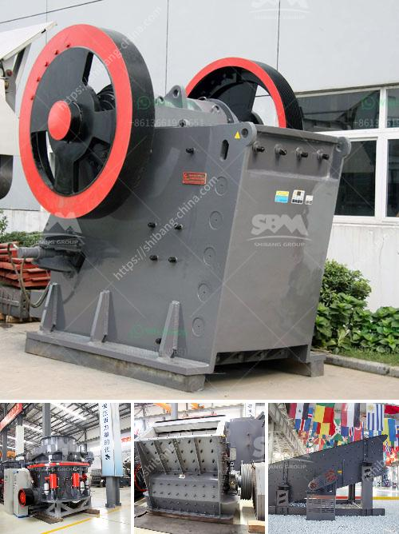

<h3>used equipment cement for sale vertical roller mills</h3>
The cement industry is one of the most important and largest contributors to greenhouse gas emissions worldwide. In recent years, there has been a greater focus on reducing carbon emissions and increasing energy efficiency in cement production. The use of vertical roller mills (VRMs) in the cement industry is one step towards achieving these goals.

VRMs are designed to grind clinker, which is a coarse powder made from limestone and other raw materials, into a fine powder. This powder is then used as a binding agent in the production of cement. Compared to traditional ball mills, VRMs have several advantages, including a lower energy consumption and a smaller footprint.

Due to the high demand for cement and the need for energy efficiency improvements, many cement plants are looking to replace their old equipment with more efficient technology. This has created a market for used equipment cement for sale, including vertical roller mills. Used VRMs offer an affordable and environmentally friendly solution for cement producers looking to upgrade their machinery.

One of the advantages of buying used equipment cement is the cost savings. Compared to buying new VRMs, used equipment allows cement producers to save a significant amount of money. This is especially important for smaller plants or those operating on a tight budget. Additionally, used equipment often comes with a shorter delivery time, allowing for quicker installation and start-up.

Another advantage of buying used equipment cement is the reduced impact on the environment. Producing new equipment requires significant amounts of resources and energy, resulting in carbon emissions. By opting for used equipment, cement producers can reduce their carbon footprint and contribute to a more sustainable cement industry.

When purchasing used vertical roller mills, it's important to ensure the equipment is in good condition. This is why it's recommended to work with reputable suppliers who have extensive knowledge and experience in the cement industry. These suppliers can provide comprehensive inspections and refurbishments to ensure the used equipment meets the required standards.

In conclusion, used equipment cement for sale, particularly vertical roller mills, offers cement producers the opportunity to upgrade their machinery and achieve energy efficiency improvements at a lower cost. By opting for used equipment, cement plants can reduce their carbon footprint and contribute to a more sustainable cement industry. It's important to work with reputable suppliers who can provide comprehensive inspections and refurbishments to ensure the used equipment meets the necessary requirements. With the increasing focus on reducing carbon emissions and improving energy efficiency, the market for used equipment cement is likely to continue growing in the coming years.
<h3>Contact us</h3><ul><li><strong>Whatsapp:&nbsp;<a href="https://wa.me/8613661969651">+8613661969651</a></strong></li><li><a href="https://swt.shibang-china.com/?git&amp;zhl&amp;used equipment cement for sale vertical roller mills"><strong>Online Service(chat now)</strong></a></li></ul><h3>Related</h3><ul><li><a href='iron ore mines equipments.md'>iron ore mines equipments</a></li><li><a href='demolition plants crushers in lima.md'>demolition plants crushers in lima</a></li><li><a href='mill for gold mining operation.md'>mill for gold mining operation</a></li><li><a href='crushing machine in philippines.md'>crushing machine in philippines</a></li><li><a href='cement factory for sale in andra pradesh.md'>cement factory for sale in andra pradesh</a></li></ul>