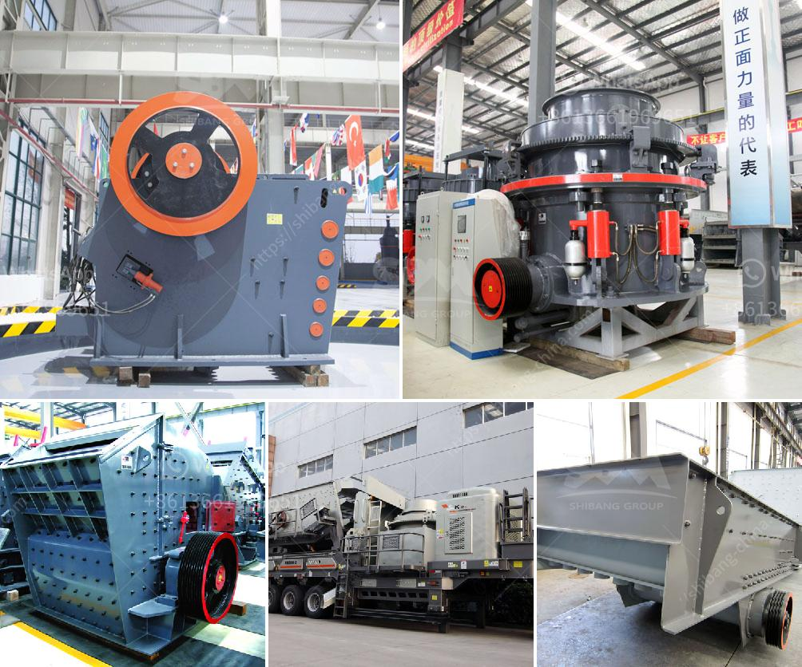

<h3>used excavators prices in uae</h3>
The construction industry in the United Arab Emirates (UAE) has been witnessing rapid growth over the past few years, leading to an increased demand for construction equipment, including excavators. Excavators play a crucial role in the excavation, grading, and demolition of buildings and infrastructural projects. However, buying new excavators can be expensive, which makes used excavators an attractive option for many businesses in the UAE.

When considering used excavators, one of the primary concerns is the pricing. The prices of used excavators in the UAE can vary based on various factors such as the age, condition, brand, and specifications of the equipment. On average, the prices of used excavators in the UAE range from AED 100,000 to AED 1,000,000.

Excavators with a price range of AED 100,000 to AED 200,000 usually consist of older models or smaller-sized excavators. These machines are often suitable for smaller construction projects or light digging work. However, buyers should be cautious and ensure that the used excavator is in good working condition and meets their specific requirements.

For those looking for slightly larger and more advanced excavators, the price range of AED 200,000 to AED 300,000 offers a wider selection. These machines often come with more features, higher horsepower, and greater digging capacities. Buyers should thoroughly inspect the equipment and consider factors such as maintenance history, warranty, and additional attachments when purchasing in this price range.

It is essential to note that prices can vary significantly depending on the specific brand and model of the used excavator. Popular brands such as Caterpillar, Komatsu, Hitachi, and Volvo tend to have higher resale values due to their reliability and durability. However, lesser-known brands might offer great value for money and lower prices.

When purchasing a used excavator, it is crucial to consider the reputation and reliability of the seller. Reputable dealers in the UAE often provide warranty options and after-sales services, ensuring customer satisfaction and peace of mind.

In conclusion, the prices of used excavators in the UAE vary based on numerous factors, including their age, condition, brand, and specifications. Buyers should carefully evaluate their requirements, thoroughly inspect the equipment, and consider credible sellers to make an informed purchasing decision. Used excavators offer a cost-effective solution for businesses looking to equip themselves with essential construction machinery while adhering to budgetary constraints.
<h3>Contact us</h3><ul><li><strong>Whatsapp:&nbsp;<a href="https://wa.me/8613661969651">+8613661969651</a></strong></li><li><a href="https://swt.shibang-china.com/?git&amp;zhl&amp;used excavators prices in uae"><strong>Online Service(chat now)</strong></a></li></ul><h3>Related</h3><ul><li><a href='limestone crusher and grinder.md'>limestone crusher and grinder</a></li><li><a href='stone crusher plant project report pdf.md'>stone crusher plant project report pdf</a></li><li><a href='how to build a gold washing plant.md'>how to build a gold washing plant</a></li><li><a href='mobile mini crusher hire.md'>mobile mini crusher hire</a></li><li><a href='buy stone crusher india.md'>buy stone crusher india</a></li></ul>