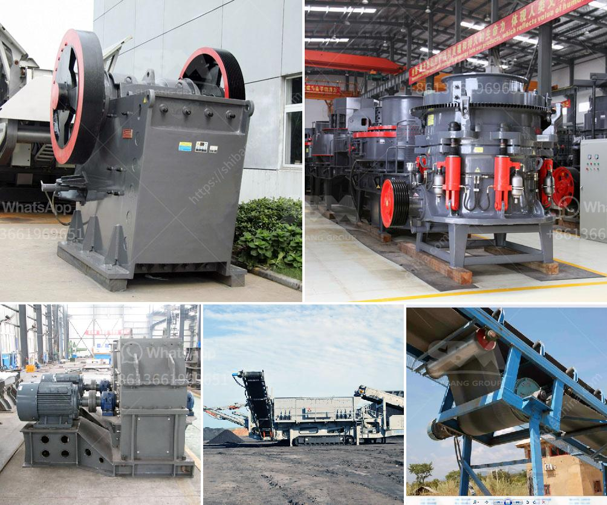

<h3>used gold mining equipment for sale in south africa</h3>
Gold mining is a vital industry in South Africa, which has been blessed with abundant gold deposits since the mid-19th century. In today's competitive global mining environment, finding and extracting precious metal is paramount to the success of any gold mining operation. However, in a country like South Africa, with over a century of gold mining history, exploring these valuable natural resources brings great challenges.

To mine efficiently, it's crucial that all the available materials and equipment are utilised to their full potential. Indeed, the business of gold mining, which requires a significant upfront investment, always pays dividends in the long term. One rewarding aspect of being an entrepreneur in the mining industry is constantly finding new and innovative ways to extract gold profitably. For this reason, the use of new mining equipment is often considered a crucial aspect of preserving efficiency in the mining process.

In this article, we delve into the reasons behind the increasing demand for used gold mining equipment for sale in South Africa. Among the reasons for this trend is the fact that gold mining is still a prevalent and booming industry in the country, presenting a wealth of viable opportunities for miners with equipment sales experience.

South Africa's long history of mining dates back to the early 1800s, when the first copper mine was established on Springbokfontein Farm in Springbok in the Northern Cape. Nowadays, you can find gold mines all over the country. Besides that, the industry also has a long-standing history of owning and acquiring efficient mining equipment.

As a result, mining equipment suppliers in South Africa offer numerous opportunities for skilled miners to get their hands on the latest and cutting-edge equipment. However, with mining companies and equipment manufacturers opting to consolidate and cut costs through methods such as acquisitions and divestments, it's becoming increasingly challenging to identify and access correct mining equipment inventories.

This is where the extensive range of high-quality and reliable used gold mining equipment comes into play. Gold mining equipment like excavators, loaders, trucks, and diggers are essential within the mining industry and can be used for various applications. Sorting, crushing, and separation of gold are the most popular methods of extracting gold from the rocks and other debris found within the mines.

The usage of used equipment not only enables mining companies to acquire necessary machinery at lower prices but also allows them to conserve their capital expenditure and ease the burden on their balance sheet. Moreover, investing in used gold mining equipment is a cost-effective alternative to brand new equipment, ensuring that companies can make the most of their mining operations.

With many miners finally seeing positive signs of recovery in the industry, it is an excellent time for resource investors and speculators to focus on South Africa's increasing gold production. Buying used gold mining equipment for sale in South Africa allows a contractor to claim back the costs of mining equipment deemed unnecessary for the work they are now performing.

As a result, gold miners are advancing in their endeavors and reducing overhead costs by obtaining second-hand equipment. Adding to their rapid return on investment, companies are always provided with high-quality and durable machinery which meets stringent industry standards.

In conclusion, the opportunities for mining companies in South Africa are vast and essential resources are available. By utilizing reliable and cost-effective used gold mining equipment, it is possible to develop high-quality mines that yield impressive returns on investment.
<h3>Contact us</h3><ul><li><strong>Whatsapp:&nbsp;<a href="https://wa.me/8613661969651">+8613661969651</a></strong></li><li><a href="https://swt.shibang-china.com/?git&amp;zhl&amp;used gold mining equipment for sale in south africa"><strong>Online Service(chat now)</strong></a></li></ul><h3>Related</h3><ul><li><a href='about aggregate crusher plants.md'>about aggregate crusher plants</a></li><li><a href='rock crusher plant.md'>rock crusher plant</a></li><li><a href='stone crusher plant kyc.md'>stone crusher plant kyc</a></li><li><a href='clay kaolin processing equipment.md'>clay kaolin processing equipment</a></li><li><a href='stone crusher vibrating screen for sale.md'>stone crusher vibrating screen for sale</a></li></ul>