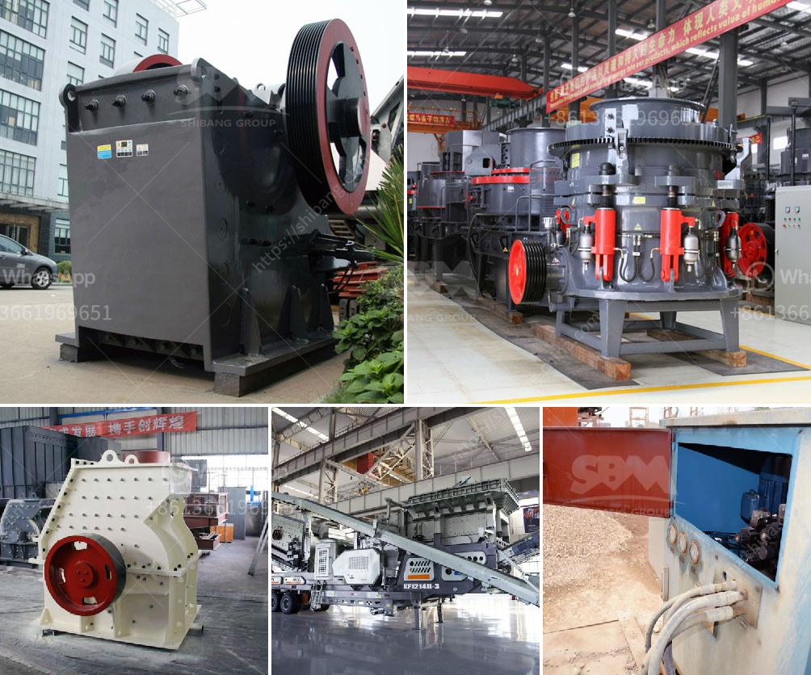

<h3>used horizontal impact crusher hazemag</h3>
The Hazemag horizontal impact crusher has become an indispensable tool for the production of high-quality aggregates. Used primarily in the construction and mining industries, the horizontal impact crusher is capable of effectively crushing a variety of materials such as limestone, dolomite, gravel, concrete, and asphalt.

One of the key features that makes the Hazemag horizontal impact crusher a versatile and effective crushing machine is its hydraulically adjustable impact apron. This apron allows operators to adjust the distance between the rotor and the impact apron, ensuring that the desired crushed product size is achieved. This feature not only enhances overall operational efficiency but also ensures consistent and uniform product quality.

In addition, the Hazemag horizontal impact crusher is equipped with a hydraulic system that provides rapid and convenient access to the crushing chamber. This system enables quick and easy maintenance and inspection, minimizing downtime and maximizing productivity. Furthermore, the crusher's robust construction ensures durability and reliability, even in demanding working conditions.

When purchasing a used Hazemag horizontal impact crusher, it is essential to consider factors such as the machine's age, condition, and maintenance history. Conducting a thorough inspection and seeking expert advice can help determine the overall quality and performance of the crusher. Additionally, it is crucial to ensure that the crusher is properly serviced and any necessary repairs or replacements are performed before putting it into operation.

Used horizontal impact crushers from Hazemag offer a cost-effective solution for companies looking to expand their crushing capacities without investing in a new machine. These crushers provide an excellent opportunity to acquire reliable equipment at a fraction of the cost of a new crusher. By choosing a reputed seller and ensuring thorough inspections, businesses can secure a used horizontal impact crusher that meets their specific requirements and delivers exceptional performance.

In conclusion, the Hazemag horizontal impact crusher is a dependable and versatile crushing machine that offers excellent performance and efficiency. Whether used in mining, construction, or recycling applications, this crusher provides consistent and high-quality crushed products. When investing in a used horizontal impact crusher, it is essential to conduct inspections, seek expert advice, and prioritize regular maintenance to ensure optimal performance. With proper care and maintenance, a used Hazemag horizontal impact crusher can serve as a valuable asset for any company in need of crushing equipment.
<h3>Contact us</h3><ul><li><strong>Whatsapp:&nbsp;<a href="https://wa.me/8613661969651">+8613661969651</a></strong></li><li><a href="https://swt.shibang-china.com/?git&amp;zhl&amp;used horizontal impact crusher hazemag"><strong>Online Service(chat now)</strong></a></li></ul><h3>Related</h3><ul><li><a href='pf series impact crusher.md'>pf series impact crusher</a></li><li><a href='slag grinding machine.md'>slag grinding machine</a></li><li><a href='manufacture of conveyor belts in mexico.md'>manufacture of conveyor belts in mexico</a></li><li><a href='3 roller raymond mill india.md'>3 roller raymond mill india</a></li><li><a href='lime processing plant.md'>lime processing plant</a></li></ul>